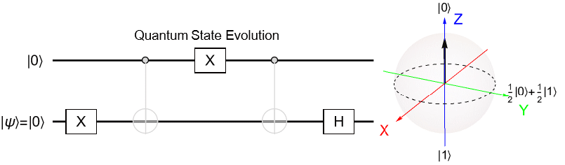
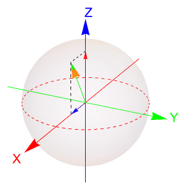

## Project goal
::: {.hero}
The goal of this project is to establish a quantum-energy training program that addresses real-world challenges in power systems using quantum techniques and offers tailored cross-disciplinary training.

First, create a project-based training program that synthesizes **interdisciplinary knowledge from power engineering and quantum computing**, thereby cultivating trainees who are proficient in both fields.

Second, offer trainees **hands-on experience and practical application** in power system-oriented quantum computing, coupled with personalized feedback, to enhance the widespread adoption of quantum computing.

Third, create a seamless integration between **problem-solving, training, and career advancement**.

Overall, this project aims to train a quantum-ready workforce in power engineering, preparing them to meet future challenges and opportunities in this cross-disciplinary field.
:::

## Quantum Computing Basics

Quantum computing represents information using **qubits** rather than classical bits. While a classical bit takes either the value 0 or 1, a qubit can exist in a superposition,

$$
|\psi\rangle
=
\alpha |0\rangle
+
\beta |1\rangle,
$$

where $\alpha$ and $\beta$ are complex probability amplitudes satisfying

$$
|\alpha|^2+|\beta|^2=1.
$$

A single-qubit state can be visualized geometrically using the **Bloch sphere**. Different points on the sphere correspond to different quantum states, providing an intuitive picture of superposition, amplitude, and phase.

{fig-align="center" width="75%"}

Quantum computation is performed by applying **quantum gates** to these states. Single-qubit gates rotate an individual quantum state, while multi-qubit gates can create interactions and entanglement between qubits.

The following example illustrates how a sequence of quantum gates changes a two-qubit state and how the corresponding state evolves during the circuit.

{fig-align="center" width="30%"}

These concepts—**superposition, quantum gates, state evolution, and entanglement**—form the foundation of the quantum algorithms explored throughout the projects below.

---

## Featured Projects

::: {.project-grid} 
 
::: {.project-card} 
### Project 1 — Quantum Data Encoding for Power System Modeling

Variational quantum classification for complex-valued power-system data.

[View project →](projects/project1.qmd) 
::: 

::: {.project-card} 
### Project 2 — Quantum Optimization for Optimal Placement of PMUs in Power Systems

QAOA-based optimization for efficient power-system observability and PMU placement.

[View project →](projects/project2.qmd) 
::: 

::: {.project-card} 
### Project 3 — Constrained Quantum Optimization for Power-Electronic Converter Control

Constrained QAOA for optimal modular multilevel converter cell selection.

[View project →](projects/project3.qmd) 
:::

::: {.project-card} 
### Project 4 — Quantum Computing for Contingency Analysis

QAOA-based combinatorial search for higher-order power-system contingencies.

[View project →](projects/project4.qmd) 
::: 
 
::: {.project-card} 
### Project 5 — Advanced Computational Methods for Power System Stability Enhancement

Gradient-aware controller optimization for improving power-system small-signal stability.

[View project →](projects/project5.qmd) 
::: 
 
::: {.project-card} 
### Project 6 — Quantum Computing for Power System Dynamic Simulation

Carleman-based transformation of nonlinear dynamics for quantum simulation.

[View project →](projects/project6.qmd) 
::: 

:::

## Acknowledgement

This work is supported by the **National Science Foundation (NSF)** under **Award OAC-2417773**. The views and conclusions presented here are those of the authors and do not necessarily reflect those of the NSF.

Generative AI tools, including **ChatGPT**, were used to assist with drafting, editing, and code refinement. All AI-assisted content was reviewed by the authors.

This website was built with **Quarto**, and we gratefully acknowledge the Quarto project for its open-source publishing tools.
