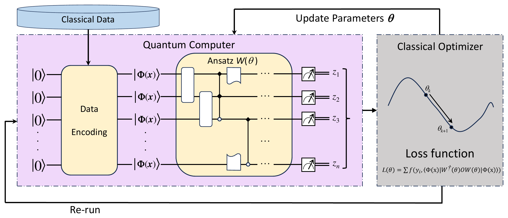
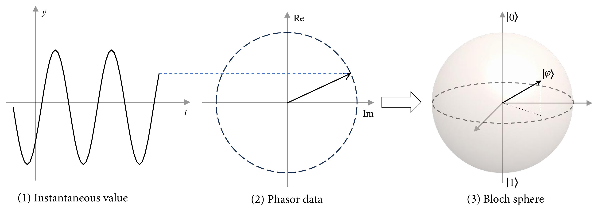
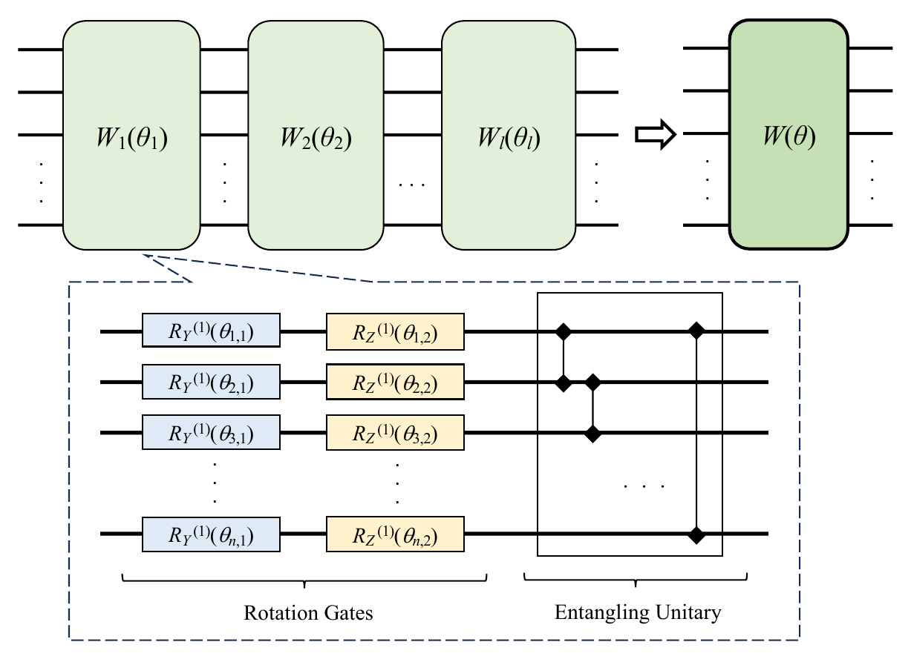
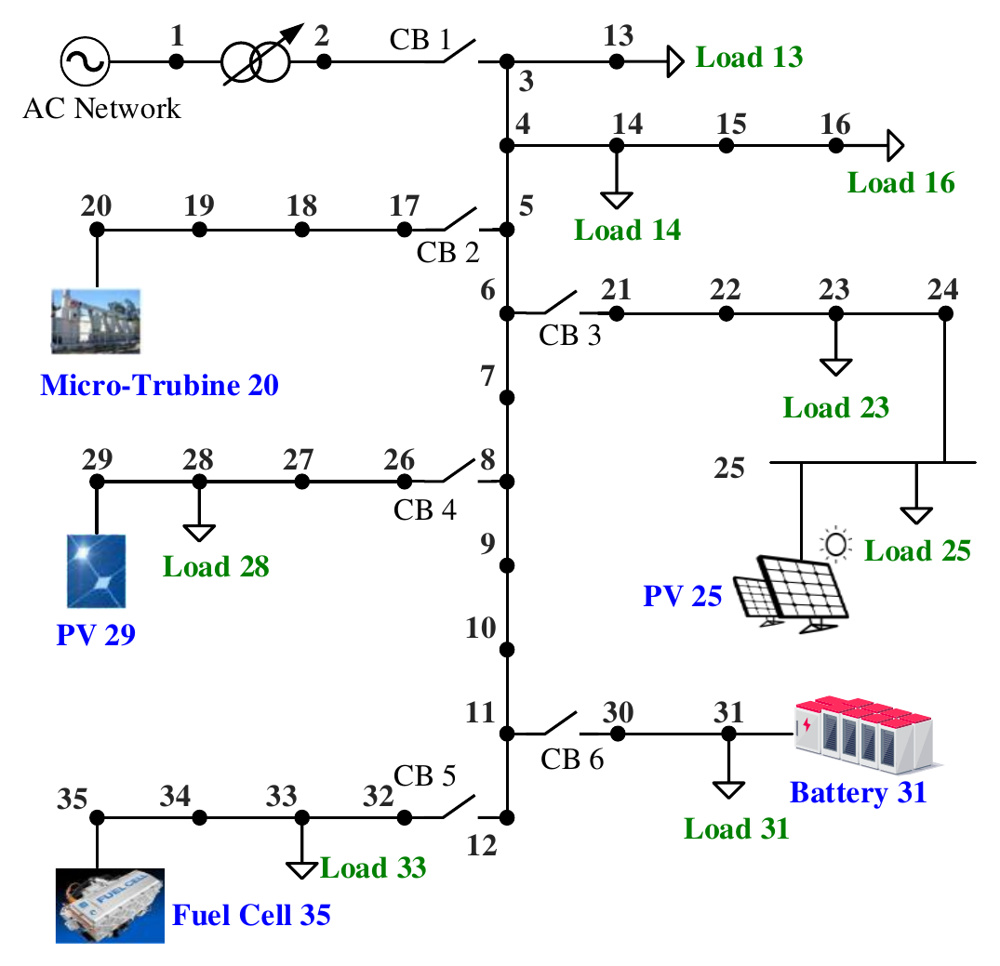
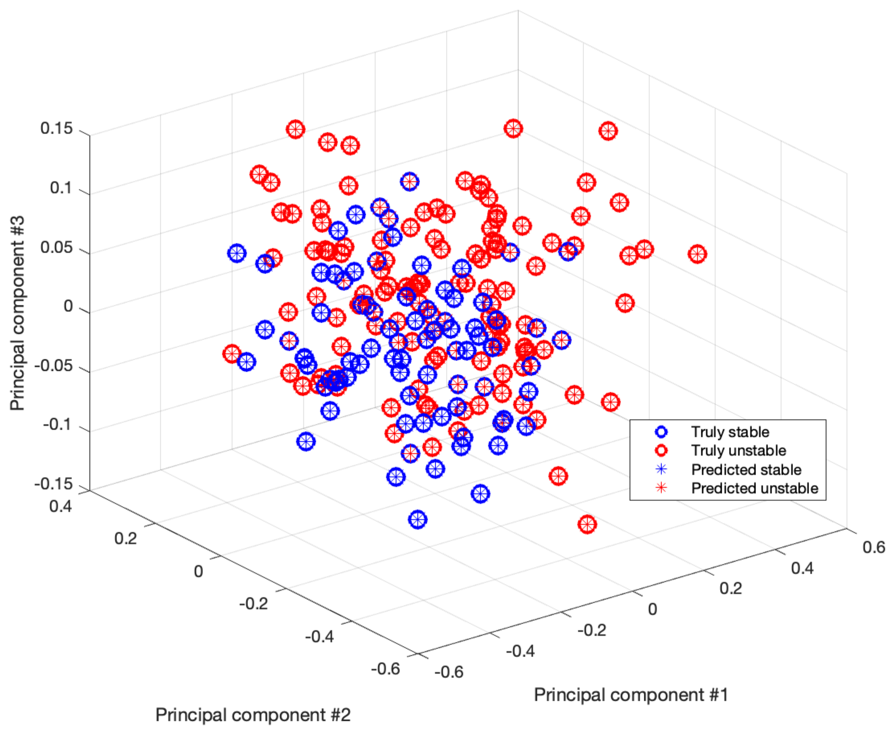
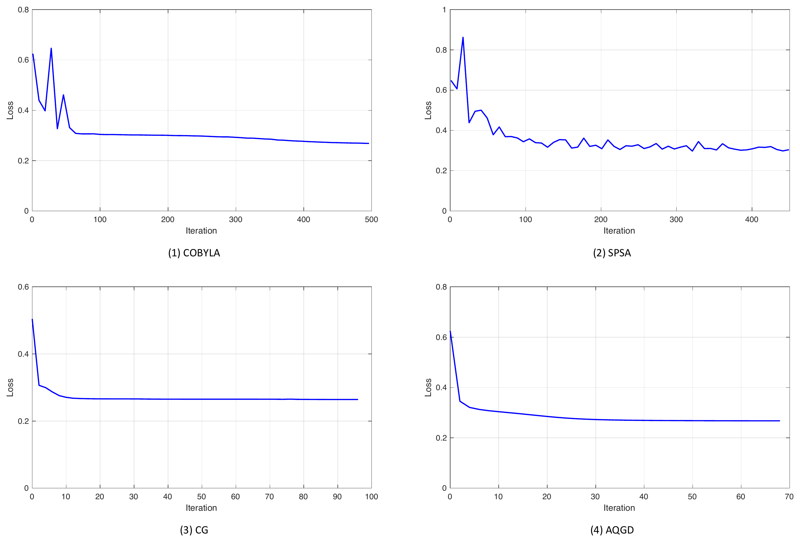

## Overview

::: {.hero}
This project develops effective quantum data encoding methods for modeling power grids and performing advanced power system computations within quantum circuits.

It begins with fundamental power system concepts, including the admittance matrix, phasor representation, and the computational challenges of classical methods.

The project also introduces essential quantum computing concepts, such as qubits, the Bloch sphere, superposition, and entanglement.

Building on this foundation, it explores multiple quantum data encoding strategies and compares their advantages, limitations, and practical applications across different power system analysis scenarios.
:::

---

## Motivation

Many engineering datasets are naturally represented by complex numbers. In AC power systems, for example, electrical quantities such as voltage, current, and power are commonly represented as phasors.

Complex power is expressed as

$$
S = P + jQ = |S|e^{j\phi},
$$

where $P$ and $Q$ denote active and reactive power.

Most quantum machine-learning pipelines, however, encode real-valued features into quantum circuits and therefore require the real and imaginary components of complex data to be treated separately.

This project investigates whether the **complex Hilbert space of quantum states can be used directly to represent complex-valued engineering data**, avoiding this separation and reducing the required number of qubits.

---

## Core Idea

For a normalized complex-valued feature vector

$$
\mathbf{x}
=
[x_1,x_2,\ldots,x_N]^T
\in \mathbb{C}^{N},
$$

amplitude encoding maps the features directly into a quantum state,

$$
|\Phi(\mathbf{x})\rangle
=
\sum_{k=1}^{N} x_k |k\rangle.
$$

For power-system data, the active and reactive powers can be combined into complex-valued features,

$$
\mathbf{s}
=
[P_1+jQ_1,\,
P_2+jQ_2,\,
\ldots,\,
P_m+jQ_m]^T.
$$

Instead of separating $P_i$ and $Q_i$, the proposed **coupling encoding strategy** embeds each complex power directly into the amplitude of the quantum state.

After normalization and augmentation, the encoded state takes the form

$$
|\Phi(\mathbf{s})\rangle
=
\sum_{i=1}^{m}
(\hat P_i+j\hat Q_i)|i\rangle
+
\frac{1}{\sqrt{\|\mathbf{s}\|_2^2+1}}
|m+1\rangle.
$$

This representation preserves both the real and imaginary components within a single quantum amplitude.

---

## Variational Quantum Classifier

The encoded quantum state is processed by a parameterized quantum circuit

$$
W(\boldsymbol{\theta})
=
W_l(\boldsymbol{\theta}_l)
\cdots
W_2(\boldsymbol{\theta}_2)
W_1(\boldsymbol{\theta}_1).
$$

Each layer contains parameterized $R_Y$ and $R_Z$ rotations together with controlled-$Z$ entangling gates between neighboring qubits.

The classifier output is obtained from the expectation value of an observable $O$,

$$
\hat y_i =
\langle
\Phi(\mathbf{x}_i)
|
W^\dagger(\boldsymbol{\theta})
O
W(\boldsymbol{\theta})
|
\Phi(\mathbf{x}_i)
\rangle.
$$

The variational parameters are optimized classically by minimizing a classification loss,

$$
\mathcal{L}(\boldsymbol{\theta})
=
\sum_i
f(y_i,\hat y_i).
$$

The project evaluates multiple combinations of **data encoding methods, loss functions, and classical optimizers**.

---

## Method

The overall workflow consists of:

1. **Generate power-system operating conditions**  
   Simulate stable and unstable equilibrium points of a 10-bus microgrid.

2. **Construct complex-valued features**  
   Combine active and reactive power measurements as
   $S_i=P_i+jQ_i$.

3. **Encode classical data into quantum states**  
   Compare coupling amplitude encoding with splitting amplitude encoding, angle encoding, and Pauli feature maps.

4. **Process the encoded states using a VQC**  
   Apply a hardware-efficient parameterized quantum circuit with $R_Y$, $R_Z$, and controlled-$Z$ gates.

5. **Optimize the variational parameters**  
   Evaluate gradient-free optimizers (COBYLA and SPSA) and gradient-based optimizers (CG and AQGD).

6. **Classify system stability**  
   Predict whether an operating point corresponds to a stable or unstable equilibrium.

---

## Framework

{fig-align="center" width="95%"}

---

## Complex-Valued Quantum Encoding

The central idea is to exploit the fact that quantum-state amplitudes are themselves complex-valued.

Rather than transforming

$$
P_i+jQ_i
$$

into two independent real-valued features, the proposed method keeps them coupled within the same quantum amplitude.

This provides a compact representation: a complex vector with up to $2^n$ components can be represented using $n$ qubits.

{fig-align="center" width="90%"}

---

## Quantum Circuit

A layered hardware-efficient ansatz is used for classification. Each layer consists of trainable single-qubit rotations followed by entangling operations,

$$
U_{\mathrm{loc}}^{(l)}
=
\bigotimes_{m=1}^{n}
R_Z(\theta_{m,2}^{(l)})
R_Y(\theta_{m,1}^{(l)}),
$$

with the entangling unitary

$$
U_{\mathrm{ent}}
=
\prod_{(i,j)\in E}
CZ(i,j).
$$

The complete variational circuit is

$$
W(\boldsymbol{\theta})
=
U_{\mathrm{loc}}^{(l)}
U_{\mathrm{ent}}
\cdots
U_{\mathrm{loc}}^{(2)}
U_{\mathrm{ent}}
U_{\mathrm{loc}}^{(1)}.
$$

A two-layer ansatz is used in the numerical experiments to balance circuit expressivity and trainability.

{fig-align="center" width="78%"}

---

## Representative Qiskit Implementation

The following code illustrates the main components of the VQC framework.  
Each block corresponds to one functional module in the workflow: **data encoding, variational circuit construction, quantum evaluation, and classical optimization**.

### 1. Amplitude Encoding

The proposed coupling strategy directly treats complex power

$$
S_i=P_i+jQ_i
$$

as complex quantum amplitudes. A shared helper function handles normalization, zero-padding, and quantum-state preparation.

```python
import numpy as np
from qiskit import QuantumCircuit
from qiskit.circuit.library import StatePreparation

def amplitude_circuit(x):
    x = np.r_[x, 1.0]
    x = x / np.linalg.norm(x)

    n = int(np.ceil(np.log2(len(x))))
    state = np.zeros(2**n, dtype=complex)
    state[:len(x)] = x

    qc = QuantumCircuit(n)
    qc.append(StatePreparation(state), range(n))
    return qc
```

The **coupling encoding** keeps $P_i$ and $Q_i$ together as one complex feature.

```python
def coupling_encoding(P, Q):
    return amplitude_circuit(
        np.asarray(P) + 1j * np.asarray(Q)
    )
```

For comparison, **splitting encoding** treats the real and imaginary parts as independent features.

```python
def splitting_encoding(P, Q):
    return amplitude_circuit(
        np.r_[P, Q].astype(complex)
    )
```

For five complex power measurements,

```python
P = np.array([0.52, 0.31, 0.47, 0.28, 0.36])
Q = np.array([0.11, 0.08, 0.13, 0.06, 0.09])

qc_coupling = coupling_encoding(P, Q)   # 3 qubits
qc_split = splitting_encoding(P, Q)     # 4 qubits
```

This compactly illustrates one of the main motivations of the proposed encoding: preserving complex-valued information while reducing the required qubit count.

---

### 2. Angle Encoding

Angle encoding first separates the real and imaginary components and maps them to parameterized rotations.

The two variants investigated in the study differ in the rotation angle used by the $R_Z$ gates.

```python
def angle_encoding(P, Q, mode="A", reps=2):
    x = np.r_[P, Q]
    qc = QuantumCircuit(len(x))

    for _ in range(reps):
        qc.h(range(len(x)))

        for i, xi in enumerate(x):
            angle = (
                2 * xi + x[(i + 1) % len(x)]
                if mode == "A" else xi
            )
            qc.rz(angle, i)

    return qc
```

The two feature maps are then constructed as

```python
qc_A = angle_encoding(P, Q, mode="A")
qc_B = angle_encoding(P, Q, mode="B")
```

---

### 3. Variational Quantum Circuit

After encoding, the quantum state is processed by a two-layer hardware-efficient ansatz.

Each layer contains trainable $R_Y$ and $R_Z$ rotations followed by neighboring controlled-$Z$ gates.

```python
from qiskit.circuit import ParameterVector

def build_vqc(n, layers=2):
    theta = ParameterVector("θ", 2 * n * layers)
    qc = QuantumCircuit(n)

    k = 0
    for layer in range(layers):
        for q in range(n):
            qc.ry(theta[k], q)
            qc.rz(theta[k + 1], q)
            k += 2

        if layer < layers - 1:
            for q in range(n - 1):
                qc.cz(q, q + 1)

    return qc, theta
```

For the coupling-amplitude representation,

```python
ansatz, theta = build_vqc(
    n=3,
    layers=2
)
```

---

### 4. Quantum Evaluation

For each sample, the encoded state is passed through the trained VQC and an observable is measured.

Here, the expectation value of $Z$ on the first qubit is used as the classifier score.

```python
from qiskit.quantum_info import Statevector, SparsePauliOp

def vqc_score(sample, params, ansatz, theta):
    qc = coupling_encoding(
        sample.real,
        sample.imag
    )

    qc.compose(
        ansatz.assign_parameters(
            dict(zip(theta, params))
        ),
        inplace=True
    )

    state = Statevector.from_instruction(qc)

    obs = SparsePauliOp.from_list([
        ("I" * (qc.num_qubits - 1) + "Z", 1.0)
    ])

    return state.expectation_value(obs).real
```

The output is a continuous score in approximately $[-1,1]$, which can be mapped to the stable and unstable labels.

---

### 5. Classical Training Loop

The VQC parameters are optimized classically. The study evaluates several optimizers; the following example uses the $l_2$ loss and COBYLA.

```python
from scipy.optimize import minimize

def mse_loss(params, X, y, ansatz, theta):
    pred = np.array([
        vqc_score(x, params, ansatz, theta)
        for x in X
    ])

    return np.mean((pred - y) ** 2)
```

The complete optimization loop is then only a few lines:

```python
def train_vqc(X, y, ansatz, theta):
    x0 = np.random.uniform(
        -np.pi,
        np.pi,
        len(theta)
    )

    return minimize(
        mse_loss,
        x0,
        args=(X, y, ansatz, theta),
        method="COBYLA"
    )
```

Training can therefore be written as

```python
result = train_vqc(X_train, y_train, ansatz, theta)

y_pred = [
    1 if vqc_score(x, result.x, ansatz, theta) >= 0 else -1
    for x in X_test
]

accuracy = np.mean(np.asarray(y_pred) == y_test)
```

## Power-System Case Study

The framework is evaluated using a **10-bus microgrid** containing:

- 5 renewable energy sources,
- 5 power loads,
- multiple stable and unstable equilibrium points.

For each operating point, active and reactive power from the five renewable-energy buses are selected, giving

$$
[P_1,Q_1,P_2,Q_2,\ldots,P_5,Q_5].
$$

These ten real-valued quantities are combined into five complex-valued features,

$$
[P_1+jQ_1,\ldots,P_5+jQ_5].
$$

{fig-align="center" width="65%"}

---

## Key Results

### Data-Encoding Comparison

The proposed coupling amplitude encoding achieved the highest classification performance among the investigated encoding methods.

| Encoding Method | Qubits | Accuracy | Precision | Recall | F1-score |
|---|---:|---:|---:|---:|---:|
| Angle Encoding A | 10 | 66.5% | 63.8% | 98.2% | 77.3% |
| Angle Encoding B | 10 | 73.2% | 73.6% | 84.1% | 78.5% |
| Pauli Feature Map | 5 | 85.1% | 80.0% | 99.1% | 88.5% |
| PCA + Angle Encoding A | 3 | 86.6% | 81.3% | 100% | 89.7% |
| PCA + Angle Encoding B | 3 | 82.5% | 77.6% | 98.2% | 86.7% |
| PCA + Pauli Feature Map | 3 | 81.4% | 77.3% | 96.5% | 85.8% |
| Splitting Amplitude Encoding | 4 | 88.6% | 85.8% | 96.5% | 90.8% |
| **Coupling Amplitude Encoding** | **3** | **92.3%** | **89.5%** | **98.2%** | **93.7%** |

The coupling strategy therefore achieved both **the highest test accuracy** and a **compact three-qubit representation**.

The result demonstrates the benefit of preserving complex-valued information directly within quantum-state amplitudes instead of separating the real and imaginary components.

{fig-align="center" width="92%"}

---

## Effect of Loss Functions

Four loss functions were evaluated using the same VQC framework.

| Loss Function | Accuracy | Precision | Recall | F1-score |
|---|---:|---:|---:|---:|
| $l_1$ | 88.1% | 58.9% | 100% | 74.1% |
| **$l_2$** | **92.3%** | **89.5%** | **98.2%** | **93.7%** |
| Cross-Entropy | 89.1% | 85.4% | 98.2% | 91.4% |
| **Misclassification-based** | **92.3%** | **89.5%** | **98.2%** | **93.7%** |

Both the $l_2$ loss and the misclassification-based loss achieved the highest test accuracy of **92.3%**.

The experiments also illustrate the non-convex optimization landscape of VQCs, including local minima and regions with small gradients.

<!-- Loss-landscape figure omitted from the website version to keep the project page concise. -->

---

## Optimizer Comparison

The study also compares two gradient-free optimizers,

- COBYLA
- SPSA

with two gradient-based optimizers,

- Conjugate Gradient (CG)
- Analytic Quantum Gradient Descent (AQGD).

The gradient-based methods generally achieve slightly higher classification accuracy, while SPSA exhibits larger fluctuations during optimization.

For example, with Angle Encoding B:

| Optimizer | Accuracy |
|---|---:|
| COBYLA | 86.6% |
| SPSA | 83.0% |
| **CG** | **88.7%** |
| AQGD | 88.1% |

{fig-align="center" width="95%"}

---

## Main Contributions

- Developed a **coupling amplitude encoding strategy for complex-valued data**, directly embedding real and imaginary information into complex quantum amplitudes.

- Demonstrated that the proposed representation can reduce the required quantum resources while improving classification performance, achieving **92.3% accuracy with only 3 qubits** on the microgrid dataset.

- Systematically compared multiple **quantum data encoding methods**, including angle encoding, Pauli feature maps, splitting amplitude encoding, and coupling amplitude encoding.

- Investigated the effects of **loss functions and classical optimizers** on VQC performance and optimization behavior.

- Demonstrated the applicability of variational quantum machine learning to a practical **power-system stability classification** problem using complex-valued electrical measurements.

---

## Related Publication

**J. Chen and Y. Li**,  
*"Empowering Complex-Valued Data Classification with the Variational Quantum Classifier."*

This work develops and evaluates the complex-valued VQC framework presented on this page.