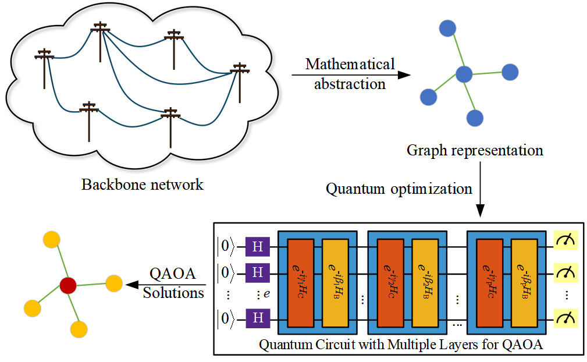
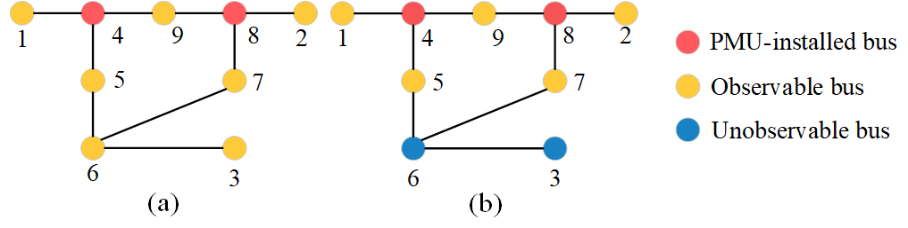
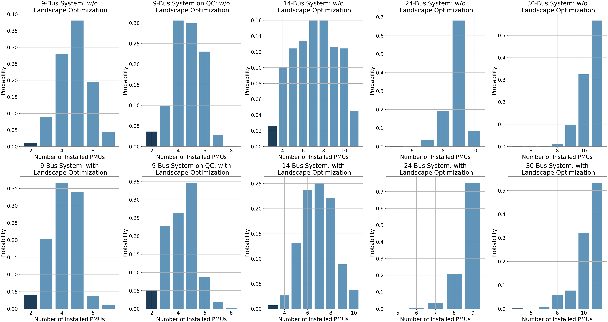
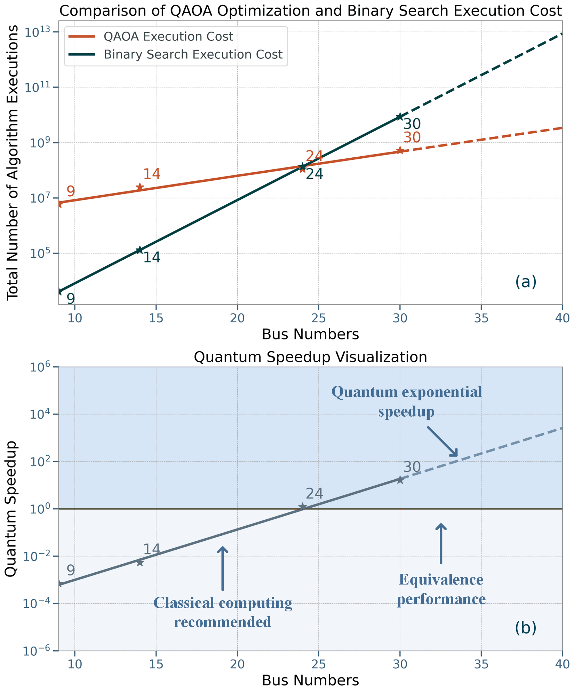
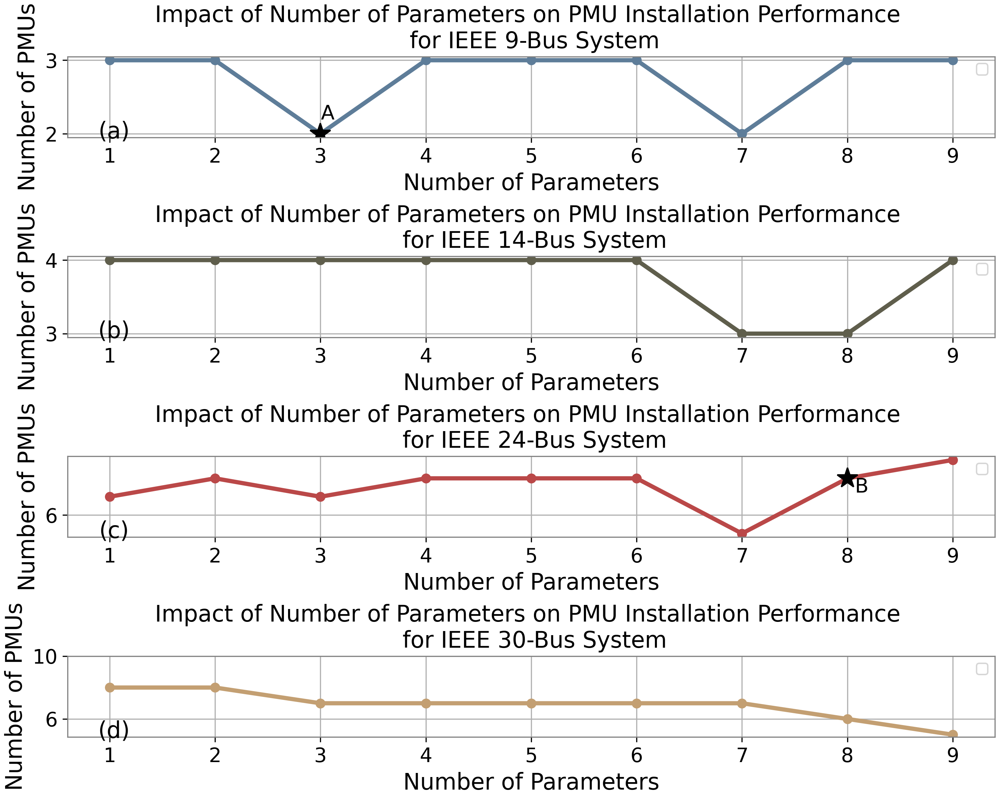

## Overview

::: {.hero}
This project applies quantum computing to enhance power system resilience, with a focus on optimal Phasor Measurement Unit (PMU) placement under high renewable penetration. It develops a hybrid quantum-classical approach based on the Quantum Approximate Optimization Algorithm (QAOA) to address PMU installation under both normal and communication-constrained scenarios.

A tailored objective function balances PMU placement cost with system observability requirements. Recursion-based Depth-First Search (DFS) and Breadth-First Search (BFS) algorithms are used to evaluate network observability. Complexity analysis shows that the proposed formulation reduces computational burden compared with conventional polynomial- or exponential-scale approaches.

The framework is validated on IEEE 9-, 14-, 24-, and 30-bus test systems, where the quantum-enhanced approach achieves improved PMU placement results compared with the classical benchmarks considered in the study. The project also investigates landscape-optimization strategies for improving QAOA solution quality.
:::

---

## Motivation

PMUs provide synchronized measurements of voltage and current phasors and are important for real-time monitoring of modern power systems. Installing a PMU at every bus, however, is unnecessary and expensive.

Let a power grid be represented as

$$
G=(\mathcal{V},E),
$$

where $N=|\mathcal{V}|$ is the number of buses and $M=|E|$ is the number of branches.

Define a binary placement vector

$$
\mathbf{X}=[x_1,x_2,\ldots,x_N]^T,
\qquad
x_i\in\{0,1\},
$$

where $x_i=1$ means a PMU is installed at bus $i$.

The placement problem is

$$
\min_{\mathbf{X}} \sum_{i=1}^{N}x_i
$$

subject to full system observability,

$$
O(\mathbf{X})=N.
$$

A penalty form used by the hybrid optimizer is

$$
C(\mathbf{X})
=
\sum_{i=1}^{N}x_i
+
\lambda\bigl(N-O(\mathbf{X})\bigr).
$$

The challenge is that PMU placement is a binary combinatorial optimization problem whose search space grows as $2^N$.

---

## Framework

{fig-align="center" width="96%"}

The workflow keeps the expensive combinatorial search in the QAOA loop while evaluating observability with lightweight graph operations on a classical computer.


---

## Core Idea

The framework separates the problem into a **quantum search module** and a **classical observability module**.

The binary placement variable is mapped to the QAOA spin convention by

$$
y_i=-2x_i+1,
\qquad
y_i\in\{-1,+1\}.
$$

The cost Hamiltonian is decomposed into

$$
H_C=H_A+H_{A'},
$$

where

$$
H_A
=
-\sum_{i=1}^{N}
\frac{\sigma_i^z-1}{2}
$$

represents the number of installed PMUs, while

$$
H_{A'}
=
\lambda
\left[
N-\mathcal{M}(\mathbf{X})
\right]
$$

contains the observability penalty evaluated by the classical graph algorithm $\mathcal{M}$.

For an $s$-layer QAOA circuit,

$$
|\psi_s(\boldsymbol{\gamma},\boldsymbol{\beta})\rangle
=
\prod_{l=1}^{s}
 e^{-i\beta_l H_B}
 e^{-i\gamma_l H_C}
|+\rangle^{\otimes N},
$$

with mixer Hamiltonian

$$
H_B=\sum_{i=1}^{N}\sigma_i^x.
$$

A classical optimizer updates $\boldsymbol{\gamma}$ and $\boldsymbol{\beta}$, while sampled bit strings are evaluated for PMU count and observability.

---

## Graph-Based Observability Modeling

A PMU directly measures the voltage at its bus and currents on connected branches. Additional states can be inferred using Ohm's law and Kirchhoff's Current Law (KCL).

The proposed recursive observability method propagates known information across the network until no new buses can be determined. Each bus is processed at most once and each branch at most a constant number of times, giving

$$
\boxed{\mathcal{O}(N+M)}.
$$

This replaces inequality-based observability checks whose matrix operations scale as approximately

$$
\mathcal{O}(N^2).
$$

{fig-align="center" width="90%"}

---

## Method

The project follows this workflow:

1. **Represent the grid as a graph** $G=(\mathcal{V},E)$.
2. **Encode PMU placement as binary variables** $\mathbf{X}$.
3. **Evaluate observability recursively** using PMU measurements, Ohm's law, and KCL.
4. **Construct the QAOA objective** from PMU count and observability penalties.
5. **Run the parameterized QAOA circuit** and sample placement strings.
6. **Score samples classically** using the graph-based observability module.
7. **Update QAOA parameters** using COBYLA.
8. **Optionally reshape the landscape** using strategic placement penalties.
9. **Extend the observability module** to non-zero injection and channel-limited PMUs.

---

## Representative Qiskit Implementation

The code below is intentionally compact. Each block represents one module in the hybrid workflow rather than a full research implementation.

### 1. Observability Module

This module evaluates a sampled PMU placement. It implements the recursive propagation idea used by the graph-based observability model.

```python
from collections import defaultdict

def observable_count(graph, pmus):
    seen, hits = set(pmus), defaultdict(int)

    def visit(u):
        for v in graph[u]:
            if v in seen:
                continue
            hits[v] += 1
            if hits[v] >= len(graph[v]) - 1:
                seen.add(v)
                visit(v)

    for u in list(pmus):
        visit(u)

    return len(seen)
```

The output is the number of fully observable buses $O$, which is used directly by the objective function.

### 2. PMU Placement Cost

This small module combines installation cost and the observability penalty.

```python
def placement_cost(bits, graph, lam):
    pmus = {i for i, b in enumerate(bits) if b}
    O = observable_count(graph, pmus)
    return len(pmus) + lam * (len(graph) - O)
```

Feasible strings have $O=N$, so the objective reduces to the number of installed PMUs.

### 3. QAOA Circuit

The quantum module prepares a superposition, applies the PMU-count cost phase, and mixes the candidate strings. The observability penalty is evaluated classically after sampling, consistent with the hybrid formulation.

```python
from qiskit import QuantumCircuit

def qaoa_circuit(n, gamma, beta):
    qc = QuantumCircuit(n)
    qc.h(range(n))

    for g, b in zip(gamma, beta):
        for q in range(n):
            qc.rz(-g, q)
        for q in range(n):
            qc.rx(2 * b, q)

    qc.measure_all()
    return qc
```

### 4. Hybrid Objective

The circuit produces a distribution of candidate placements. This module scores that distribution using the classical observability model.

```python
from qiskit import transpile
from qiskit_aer import AerSimulator

sim = AerSimulator()

def expected_cost(qc, graph, lam, shots=10000):
    result = sim.run(transpile(qc, sim), shots=shots).result()
    counts = result.get_counts()

    total = 0.0
    for state, count in counts.items():
        bits = [int(x) for x in state[::-1]]
        total += count * placement_cost(bits, graph, lam)

    return total / shots
```

### 5. Classical Parameter Update

COBYLA updates the $2s$ QAOA parameters using the sampled hybrid objective.

```python
import numpy as np
from scipy.optimize import minimize

def train_qaoa(graph, layers, lam):
    n = len(graph)

    def loss(theta):
        g, b = np.split(theta, 2)
        return expected_cost(qaoa_circuit(n, g, b), graph, lam)

    x0 = np.random.uniform(0, np.pi, 2 * layers)
    return minimize(loss, x0, method="COBYLA")
```

The research experiments use deeper circuits and many more repeated circuit executions; this snippet only exposes the main software modules cleanly.

### 6. Strategic Landscape Penalty

The paper further penalizes placements on low-degree buses and solutions that use too many PMUs.

```python
def strategic_penalty(bits, graph, T, P1=500, P2=500):
    low_degree = any(b and len(graph[i]) <= 2 for i, b in enumerate(bits))
    too_many = sum(bits) > T
    return P1 * low_degree + P2 * too_many
```

This module does not require additional qubits because the penalty is evaluated on the classical side of the hybrid algorithm.

### 7. Channel-Limited PMUs

For the greedy channel-limited strategy $\mathcal{M}_2$, measurement channels are preferentially assigned toward higher-degree neighboring buses.

```python
def select_channels(graph, bus, omega):
    nbrs = sorted(graph[bus], key=lambda v: len(graph[v]), reverse=True)
    return nbrs[:omega]
```

The complete channel-limited observability routine wraps this selection rule inside a BFS-style propagation process.

---

## Benchmark Systems

The numerical study uses IEEE 9-, 14-, 24-, and 30-bus systems.

| System | Qubits | QAOA Layers | Circuit Repetitions $R$ |
|---|---:|---:|---:|
| IEEE 9-bus | 9 | 7 | 10,000 |
| IEEE 14-bus | 14 | 7 | 10,000 |
| IEEE 24-bus | 24 | 7 | 300,000 |
| IEEE 30-bus | 30 | 9 | 500,000 |

The 9-bus experiment is evaluated on both an IBM noiseless simulator and IBM Brisbane. The 14- and 24-bus experiments use the IBM simulator, while the 30-bus case is simulated on classical servers.

---

## PMU Placement Results

### Zero- and Non-Zero-Injection Cases

| Test System | Zero Injection | Non-Zero Injection |
|---|---:|---:|
| IEEE 9-bus | **2** | **3** |
| IEEE 14-bus | **3** | **7** |
| IEEE 24-bus | **5** | **8** |
| IEEE 30-bus | **5** | **10** |

The 9-bus result is reproduced on both the quantum simulator and the real quantum processor. Across the reported benchmark cases, the proposed method matches or improves the best listed PMU counts depending on the system and scenario.

Representative zero-injection placements found in the study include:

| System | PMU Buses |
|---|---|
| IEEE 9-bus | 4, 6 |
| IEEE 14-bus | 2, 4, 13 |
| IEEE 24-bus | 6, 9, 10, 17, 23 |
| IEEE 30-bus | 2, 6, 10, 12, 27 |

---

## Channel-Limited Placement

The framework is also tested when each PMU can monitor only $\omega$ branches.

| System | $\omega=1$ | $\omega=2$ | $\omega=3$ | $\omega=4$ | $\omega=5$ |
|---|---:|---:|---:|---:|---:|
| 9-bus, $\mathcal{M}_2$ | 3 | 2 | 2 | 2 | 2 |
| 14-bus, $\mathcal{M}_2$ | 7 | 4 | 3 | 3 | 3 |
| 24-bus, $\mathcal{M}_2$ | 10 | 7 | 6 | 5 | 5 |
| 24-bus, $\mathcal{M}_3$ | 10 | **6** | 6 | 5 | 5 |
| 30-bus, $\mathcal{M}_2$ | 13 | 8 | 7 | **6** | **6** |
| 30-bus, $\mathcal{M}_3$ | 13 | 8 | 7 | 7 | 7 |

The randomized strategy $\mathcal{M}_3$ helps in some smaller cases, while the greedy $\mathcal{M}_2$ strategy becomes more favorable as the system size increases.

---

## Landscape Optimization

The raw QAOA distribution contains many infeasible or unnecessarily expensive placements. The paper introduces two strategic penalties:

- $P_1$: discourage PMUs at buses with degree 1 or 2 when higher-degree alternatives exist;
- $P_2$: discourage placements using more than a threshold $T$ PMUs.

Both penalties are evaluated classically and therefore do not consume additional qubits.

{fig-align="center" width="100%"}

The optimization increases the probability of obtaining the best PMU placements while reducing total execution time.

| Case | Without Optimization | With Optimization | Time Reduction |
|---|---:|---:|---:|
| 9-bus simulator | 1062.90 s | 524.54 s | **50.7%** |
| 9-bus real QC | 15571.54 s | 10124.87 s | **35.0%** |
| 14-bus simulator | 1187.03 s | 582.09 s | **51.0%** |
| 24-bus simulator | 3631.72 s | 2866.49 s | **21.1%** |
| 30-bus classical simulation | 139308.93 s | 120724.99 s | **13.3%** |

For the real 9-bus quantum-computer experiment, the probability assigned to the optimal result increases from **0.01 to 0.04** after landscape optimization.

---

## Complexity and Theoretical Scaling

For one candidate placement, the proposed observability algorithms require

$$
\mathcal{O}(N+M)
$$

classical operations.

Under the complexity assumptions used in the study, the full hybrid method is summarized as

$$
\mathcal{O}(RN)
$$

for quantum-circuit execution and

$$
\mathcal{O}(R(N+M))
$$

for classical post-processing, where $R$ is the number of circuit repetitions.

{fig-align="center" width="74%"}

The figure is a **theoretical execution-count comparison**, not a measured hardware speedup. Under the paper's scaling model, small systems favor classical search because QAOA requires many repetitions, while the projected advantage grows with system size and reaches approximately $10^4$ at 40 buses.

---

## Effect of QAOA Parameter Count

An $s$-layer QAOA circuit contains $2s$ trainable parameters. Increasing the number of parameters increases circuit expressivity but also makes the optimization landscape more difficult.

{fig-align="center" width="88%"}

The experiments show that more parameters do not automatically guarantee a better solution. Moderate depth can improve the 14- and 24-bus cases, whereas the larger 30-bus problem benefits more consistently from increased circuit expressivity.

---

## Main Contributions

- Developed an **end-to-end hybrid QAOA framework** for optimal PMU placement under normal and channel-limited scenarios.

- Proposed a **recursive graph-based observability algorithm** with $\mathcal{O}(N+M)$ complexity, avoiding the additional qubit overhead of inequality-based observability constraints.

- Formulated PMU placement as a **hybrid quantum-classical objective** in which candidate placements are generated by QAOA and feasibility is evaluated classically.

- Extended the framework to **zero-injection, non-zero-injection, and PMU-channel-limited** power-system models.

- Introduced **strategic landscape penalties** that increase the probability of useful QAOA solutions and reduce execution time without adding qubits.

- Demonstrated the methodology on **IEEE 9-, 14-, 24-, and 30-bus systems**, including a real-quantum-computer experiment for the IEEE 9-bus case.

- Studied **QAOA depth, solution distributions, and theoretical scaling** to characterize the trade-off between quantum-circuit expressivity and optimization difficulty.

---

## Related Publication

**Y. Jiang, Z. Liang, Y. Li, and T. Morstyn**,  
*"Optimal PMU Placement via Quantum Optimization."*

This work develops the QAOA formulation, graph-based observability models, channel-limited placement strategies, and landscape-optimization techniques presented on this page.
