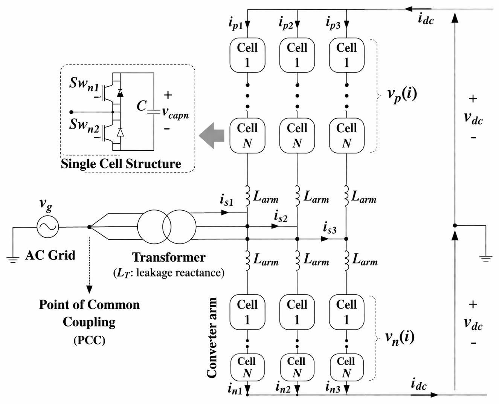
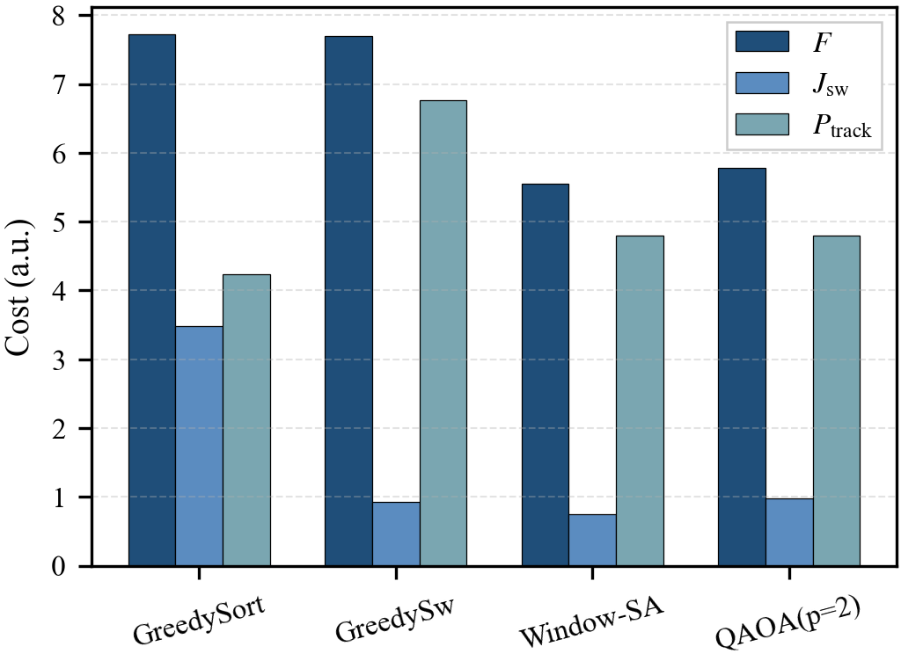
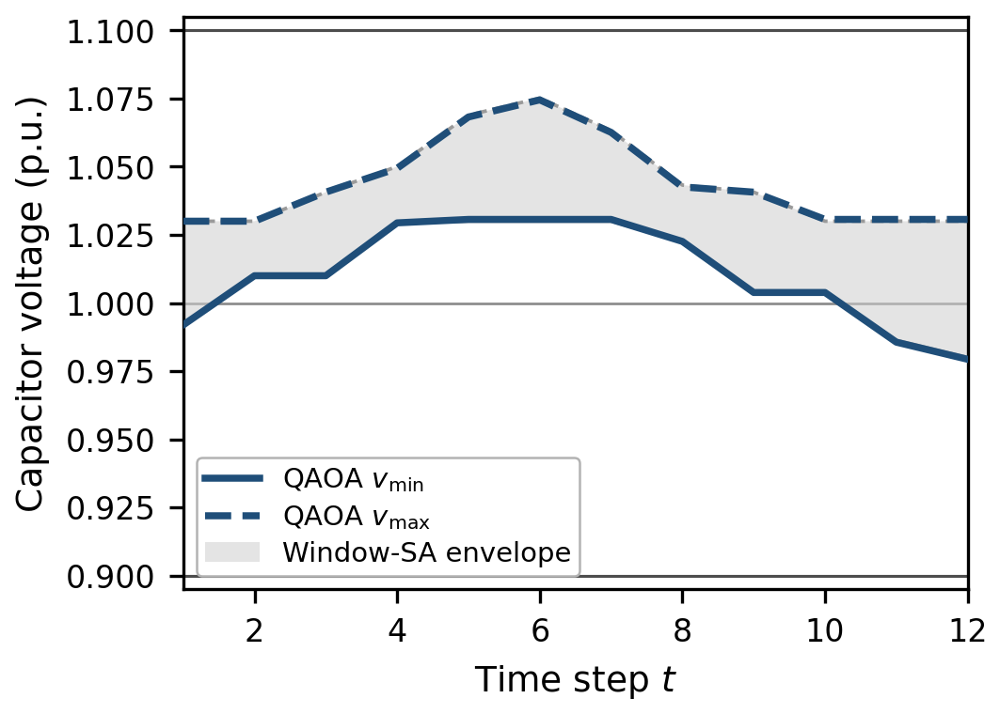

## Overview

::: {.hero}
This project extends quantum optimization from grid-level applications to device-level control of power-electronic systems. It develops a constrained-QAOA framework for cell selection in modular multilevel converters (MMCs). The optimization determines which converter submodules should be inserted at each control step while maintaining the required insertion number, reducing switching activity, and regulating capacitor voltages.

These objectives are formulated within a unified finite-horizon binary optimization framework. A key contribution is a feasible-subspace QAOA formulation that incorporates the insertion-number constraint directly into the quantum circuit. An XY mixer preserves the required Hamming weight, ensuring that quantum evolution remains within the physically admissible solution space.

The project also develops a rolling-horizon implementation that divides the full control problem into smaller sequential optimization problems suitable for near-term quantum platforms.

The framework is benchmarked against voltage-sorting greedy control, switching-aware greedy control, and feasible-subspace simulated annealing. The constrained-QAOA solution reduces the common objective by **25.2%** relative to voltage-sorting greedy control and by **24.9%** relative to switching-aware greedy control, while remaining within **4.1%** of simulated annealing.
:::

---

## Motivation

MMCs are widely used in high-voltage direct-current transmission because of their modular structure, scalability, and efficiency.

Each converter arm contains many submodules. At every sampling instant, the modulation layer specifies how many cells must be inserted, but several different insertion patterns can satisfy the same commanded arm voltage.

{fig-align="center" width="88%"}

The cell-selection layer must therefore decide **which** cells should be inserted.

These decisions are dynamically coupled because inserting a cell affects

1. the switching state at the current time step, and
2. the capacitor voltage available at future time steps.

This makes MMC cell selection a constrained combinatorial optimization problem rather than a purely local sorting task.

---

## Finite-Horizon Cell-Selection Model

Let

$$
x_{i,t}\in\{0,1\}
$$

denote the insertion state of cell $i$ at time step $t$.

The modulation layer specifies the required number of inserted cells $k_t$, giving the hard feasibility condition

$$
\sum_{i=1}^{N}x_{i,t}=k_t,
\qquad
t=1,\ldots,T.
$$

The capacitor-voltage dynamics are modeled as

$$
v_{i,t}
=
v_{i,t-1}
+
x_{i,t}\Delta v_t,
$$

where $\Delta v_t$ is determined from the externally specified or measured arm-current trajectory.

The finite-horizon objective balances switching activity and voltage regulation,

$$
F(\mathbf{x})
=
J_{\mathrm{sw}}(\mathbf{x})
+
P_{\mathrm{track}}(\mathbf{x}).
$$

The switching term is

$$
J_{\mathrm{sw}}(\mathbf{x})
=
\sum_{i=1}^{N}
\sum_{t=1}^{T}
w_t
\left(
x_{i,t}-x_{i,t-1}
\right)^2,
$$

which discourages unnecessary changes in cell status.

The voltage-tracking term is

$$
P_{\mathrm{track}}(\mathbf{x})
=
\lambda_v
\sum_{i=1}^{N}
\sum_{t=1}^{T}
\left(
v_{i,t}-v_{\mathrm{ref}}
\right)^2.
$$

Because the voltage trajectory is affine in the binary insertion variables, the complete finite-horizon objective remains quadratic.

---

## Feasible-Subspace QAOA

A central feature of this project is that the insertion-number constraint is **not enforced by a large penalty coefficient**.

Instead, the feasible set is defined as

$$
\Omega
=
\left\{
\mathbf{x}\in\{0,1\}^{NT}
\;\middle|\;
\sum_{i=1}^{N}x_{i,t}=k_t,
\ \forall t
\right\}.
$$

The QAOA mixer is chosen so that the evolution remains inside this set.

For each time slice, the XY mixer is

$$
H_M
=
\sum_{t=1}^{T}
\sum_{1\le r<s\le N}
\left(
X_{r,t}X_{s,t}
+
Y_{r,t}Y_{s,t}
\right).
$$

The corresponding excitation-number operator is

$$
\hat N_t
=
\sum_{i=1}^{N}
\frac{I-Z_{i,t}}{2}.
$$

Because

$$
[H_M,\hat N_t]=0,
$$

the mixer preserves the number of inserted cells at every time step.

Therefore, if the QAOA state is initialized from a feasible schedule,

$$
|\psi_0\rangle\in\Omega,
$$

the complete variational evolution remains feasible.

This converts the insertion-number requirement from a penalty term into a structural property of the quantum circuit.

---

## QUBO and Ising Formulation

The switching and voltage-tracking terms form a standard quadratic unconstrained binary optimization problem,

$$
F(\mathbf{x})
=
F_0
+
\sum_q a_qx_q
+
\sum_{q<r}b_{qr}x_qx_r,
$$

where a single index $q$ represents a cell-time pair $(i,t)$.

Using

$$
x_q
=
\frac{I-Z_q}{2},
$$

the QUBO is mapped to the Ising cost Hamiltonian

$$
H_C
=
E_0 I
+
\sum_q h_q Z_q
+
\sum_{q<r}J_{qr}Z_qZ_r.
$$

The constrained-QAOA state is then

$$
|\psi(\boldsymbol{\gamma},\boldsymbol{\beta})\rangle
=
\prod_{\ell=1}^{p}
e^{-i\beta_\ell H_M}
e^{-i\gamma_\ell H_C}
|\psi_0\rangle.
$$

The two Hamiltonians have distinct roles:

- $H_M$ preserves physical feasibility;
- $H_C$ evaluates the switching--voltage tradeoff.

This separation allows QAOA to optimize performance **within** the admissible schedule space rather than spending search effort on infeasible schedules.

---

## Rolling-Horizon Implementation

A direct full-horizon formulation requires

$$
NT
$$

binary decision variables and therefore scales with the complete scheduling horizon.

To improve tractability, the project uses a rolling-horizon strategy.

Let

- $\mu$ be the optimization-window length,
- $d$ be the number of committed steps per window.

At each rolling step:

1. solve the constrained-QAOA problem over the next $\mu$ time steps;
2. commit the first $d$ decisions;
3. update the capacitor voltages and insertion boundary state;
4. move the window forward and repeat.

The instantaneous physical register width is therefore reduced from

$$
\mathcal{O}(NT)
$$

to

$$
\mathcal{O}(N\mu).
$$

The state update between windows preserves the temporal dependence of the capacitor-voltage dynamics.

---


## Representative Python Implementation

The following snippets show the main software modules behind the constrained-QAOA workflow.  
The code is intentionally compact: **MMC dynamics, objective evaluation, feasible mixing, and rolling-horizon control** are kept separate.

### 1. Capacitor-Voltage Update

This module propagates capacitor voltages for a candidate insertion schedule.

```python
import numpy as np

def voltage_trajectory(x, v0, dv):
    v = [np.asarray(v0)]

    for t in range(len(dv)):
        v.append(v[-1] + x[:, t] * dv[t])

    return np.asarray(v[1:])
```

The binary matrix `x[i, t]` represents whether cell $i$ is inserted at time $t$.

### 2. Finite-Horizon Objective

The classical objective combines switching activity and capacitor-voltage tracking.

```python
def mmc_cost(x, x0, v, vref, lam):
    x_prev = np.c_[x0, x[:, :-1]]

    switching = np.sum((x - x_prev) ** 2)
    tracking = np.sum((v - vref) ** 2)

    return switching + lam * tracking
```

This directly represents the two terms used in the finite-horizon optimization.

### 3. Feasible XY Mixer

The constrained QAOA uses an XY mixer so that each time slice preserves its required number of inserted cells.

```python
from itertools import combinations

def xy_mixer(qc, beta, n_cells, horizon):
    for t in range(horizon):
        qubits = range(t*n_cells, (t+1)*n_cells)

        for i, j in combinations(qubits, 2):
            qc.rxx(2*beta, i, j)
            qc.ryy(2*beta, i, j)
```

Because the mixer exchanges excitations rather than creating or removing them, a feasible initial state remains inside the fixed-cardinality subspace.

### 4. Rolling-Horizon Control

The outer control loop repeatedly solves a short window, commits the first decision, and updates the physical state.

```python
def rolling_horizon(v, x_prev, steps, solve_window):
    schedule = []

    for t in range(steps):
        x_window = solve_window(v, x_prev, t)
        x_now = x_window[:, 0]

        schedule.append(x_now)
        x_prev = x_now
        v = update_state(v, x_now, t)

    return np.asarray(schedule)
```

The quantum optimizer is isolated inside `solve_window()`, while the rolling-horizon controller handles state propagation and commitment.

---

## Numerical Test Case

The framework is evaluated on a representative single MMC arm with

| Setting | Value |
|---|---:|
| Cells | $N=4$ |
| Horizon | $T=12$ |
| Required inserted cells | $k_t=2$ |
| QAOA depth | $p=2$ |
| Rolling window | $\mu=3$ |
| Commit length | $d=1$ |
| Reference voltage | $1.0$ p.u. |
| Monitoring range | $0.9$–$1.1$ p.u. |

The initial capacitor voltages are

$$
\mathbf{v}_0
=
[1.03,\ 0.98,\ 1.01,\ 0.99]
\ \text{p.u.},
$$

and the initial insertion state is

$$
\mathbf{x}_0
=
[1,\ 0,\ 1,\ 0].
$$

The comparison includes four methods:

- **GreedySort** — voltage-sorting greedy control,
- **GreedySw** — switching-aware greedy control,
- **Window-SA** — feasible-subspace simulated annealing,
- **QAOA ($p=2$)** — the proposed constrained quantum method.

All methods are evaluated using the same finite-horizon objective

$$
F
=
J_{\mathrm{sw}}
+
P_{\mathrm{track}}.
$$

---

## Objective Comparison

{fig-align="center" width="90%"}

The two greedy approaches emphasize different parts of the control objective.

- **GreedySort** maintains stronger local voltage balancing but produces substantially more switching.
- **GreedySw** reduces switching activity but produces a much larger voltage-tracking penalty.
- **Window-SA** provides the lowest total cost on this small test instance.
- **QAOA** produces a substantially better switching--tracking compromise than either greedy method and remains close to Window-SA.

Relative to the common finite-horizon objective, QAOA achieves

$$
25.2\%
$$

lower cost than voltage-sorting greedy and

$$
24.9\%
$$

lower cost than switching-aware greedy.

Its objective remains within

$$
4.1\%
$$

of feasible-subspace Window-SA.

These results demonstrate competitive feasible scheduling on the representative small-scale instance, although the strongest classical baseline still obtains the lowest objective value.

---

## Capacitor-Voltage Performance

{fig-align="center" width="86%"}

The QAOA trajectory remains inside the monitoring interval

$$
0.9
\le
v_{i,t}
\le
1.1
\quad \text{p.u.}
$$

throughout the simulated horizon.

The QAOA voltage envelope is slightly wider than the Window-SA envelope at several time steps, but the overall voltage behavior remains well regulated.

Importantly, these voltage limits are used in the present study for **post-solution assessment**, not as hard constraints in the QUBO. Enforcing them directly would require additional slack-variable encodings and would increase the binary-variable count, qubit requirements, and Hamiltonian coupling complexity.

---

## Modeling Assumptions

The present study is designed to validate the constrained-QAOA formulation itself and therefore adopts several simplifying assumptions.

- The analysis considers a representative **single MMC arm**.
- Circulating-current effects are neglected.
- The arm-current trajectory is treated as externally specified or predicted.
- The insertion-number requirement is enforced as the primary hard operational constraint.
- Capacitor-voltage limits are monitored after optimization rather than directly encoded as hard quantum constraints.
- The numerical case is intentionally small enough to permit controlled comparison with classical feasible-subspace methods.

These assumptions make it possible to isolate the main technical question: whether MMC cell selection can be represented as a feasible-subspace QAOA problem with a unified switching--voltage objective.

---

## Scalability Discussion

The direct finite-horizon formulation requires one binary variable for each cell-time pair,

$$
N_{\mathrm{var}}
=
NT.
$$

The rolling-horizon realization reduces the active problem size to approximately

$$
N_{\mathrm{var}}
=
N\mu.
$$

This reduction is important because the cost Hamiltonian contains temporal couplings generated by both switching transitions and cumulative capacitor-voltage evolution.

The current numerical experiment establishes **formulation-level viability** rather than a practical quantum speedup. Larger MMC instances, hardware-efficient XY-mixer implementations, noise sensitivity, and direct voltage-bound encodings remain important directions for future work.

---

## Main Contributions

- Formulated **finite-horizon MMC cell selection** as a constrained binary optimization problem that jointly considers switching activity and capacitor-voltage regulation.

- Developed a **feasible-subspace QAOA formulation** in which the insertion-number requirement is preserved directly by an XY mixer instead of enforced through large penalty coefficients.

- Constructed a **QUBO/Ising representation** of the switching--voltage objective without introducing auxiliary binary variables for the primary optimization model.

- Introduced a **rolling-horizon realization** that reduces the instantaneous quantum problem size from $\mathcal{O}(NT)$ to $\mathcal{O}(N\mu)$ while retaining temporal state evolution.

- Demonstrated feasible shallow-depth QAOA schedules that **substantially outperform representative greedy baselines** under a common finite-horizon objective.

- Showed that the QAOA solution remains **close to feasible-subspace simulated annealing** while maintaining capacitor voltages inside the monitored operating range on the representative test instance.

---

## Related Publication

**Y. Pan, Y. Li, L. Du, M. Ismail, and W. Saad**,  
*"Constrained Quantum Approximate Optimization for Modular Multilevel Converter Cell Selection."*

This work develops the feasible-subspace QAOA formulation, QUBO/Ising mapping, rolling-horizon implementation, and numerical MMC cell-selection validation presented on this page.
