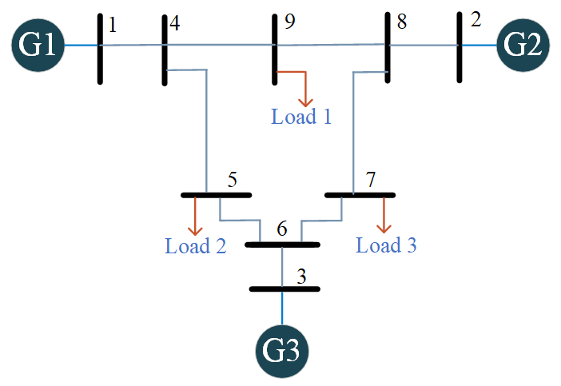
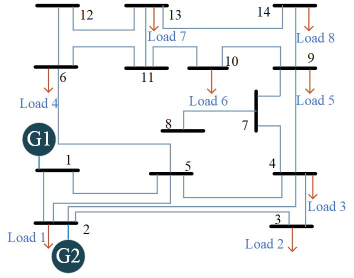
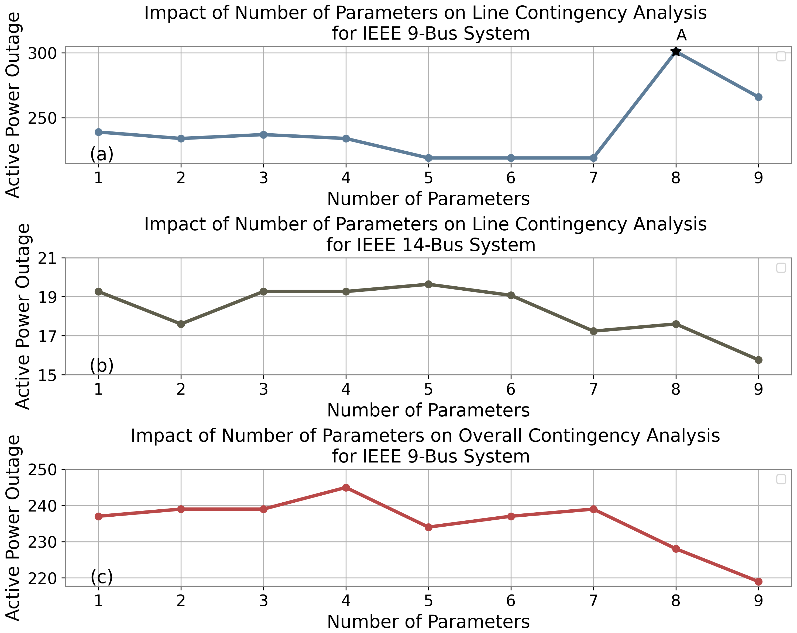
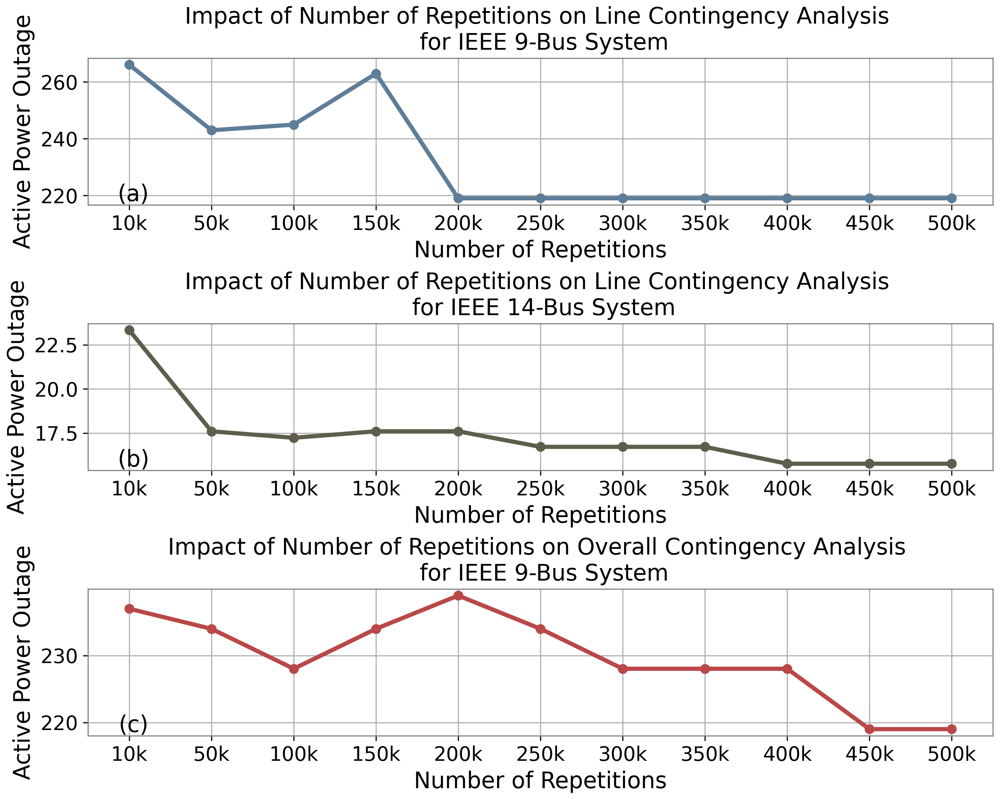
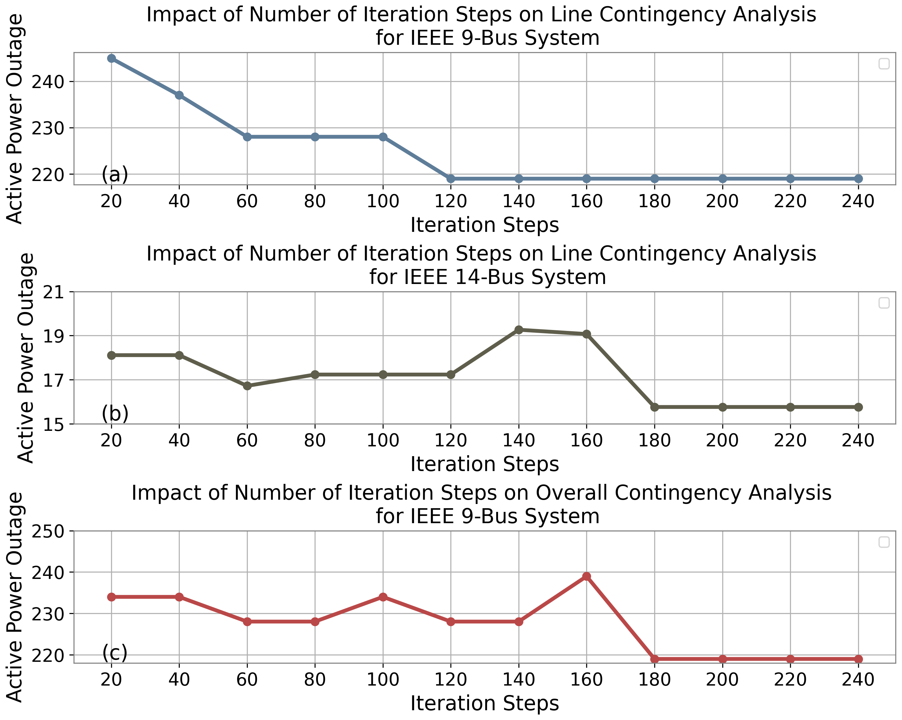

## Overview

::: {.hero}
This project develops QAOA-based formulations for $N-k$ contingency analysis in power systems. Two scenarios are considered: transmission-line contingencies and system-wide contingencies involving transmission lines, generators, and loads.

Both problems are formulated as quadratic unconstrained binary optimization models and mapped to QAOA Hamiltonians. The resulting hybrid quantum-classical framework searches for critical outage combinations while incorporating power-system operating constraints into the optimization objective.

Tests on the IEEE 9-bus system show that QAOA consistently produces near-optimal solutions. Resource analysis further shows that circuit depth and gate count increase approximately linearly with the number of QAOA layers, providing insight into implementation tradeoffs for noisy intermediate-scale quantum (NISQ) hardware.
:::

---

## Motivation

Traditional contingency analysis often begins with the $N-1$ security criterion, in which the grid is tested against the failure of one component.

More severe operating conditions require higher-order criteria,

$$
N-k,
\qquad
k>1.
$$

For a system with $N$ candidate components, the number of $k$-component outage combinations is

$$
\binom{N}{k}
=
\frac{N!}{k!(N-k)!}.
$$

For example, an $N-4$ study with 300 candidate components contains

$$
\binom{300}{4}
=
330{,}791{,}175
$$

possible combinations.

Each candidate scenario may require additional power-system analysis, making higher-order contingency screening computationally intensive.

This project investigates whether QAOA can provide a scalable quantum optimization framework for searching these combinatorial outage spaces.

---

## Core Idea

The power grid is modeled as a graph

$$
G=(\mathcal{V},E),
$$

with bus set $\mathcal{V}$ and branch set $E$.

Under the DC power-flow model,

$$
B\theta=P,
$$

where

- $B$ is the bus susceptance matrix,
- $\theta$ is the vector of voltage phase angles,
- $P$ is the vector of net active-power injections.

The contingency objective is constructed from three components:

$$
C(Z)
=
C_{\mathrm{outage}}(Z)
+
\vartheta C_{N-k}(Z)
+
\lambda C_{\mathrm{flow}}(Z).
$$

Here,

- $C_{\mathrm{outage}}$ measures the power associated with removed components,
- $C_{N-k}$ enforces the required number of outages,
- $C_{\mathrm{flow}}$ penalizes deviation from the pre-contingency operating state.

The resulting binary optimization problem is mapped to a QAOA problem Hamiltonian.

---

## Line Contingency Formulation

For line contingency, the decision variables represent transmission-line status.

A line outage modifies the DC susceptance matrix as

$$
B_{\mathrm{lc}}
=
B
-
\sum_{i\in E}
b_i
(e_{u_i}-e_{v_i})
(e_{u_i}-e_{v_i})^{\mathsf T},
$$

where

- $b_i$ is the susceptance of line $i$,
- $u_i$ and $v_i$ are its terminal buses,
- $e_{u_i}$ and $e_{v_i}$ are one-hot bus vectors.

The optimization favors outage sets that

1. satisfy the required $N-k$ contingency order,
2. remove components carrying relatively small active power, and
3. keep the post-contingency DC power-flow state close to the original operating condition.

A larger penalty is imposed when the post-contingency deviation exceeds the allowed generator-compensation range. In the numerical study, the maximum allowable percentage deviation $H$ is set to **5%**.

---

## Overall Contingency Formulation

The overall contingency scenario expands the binary search space to include

- transmission lines,
- loads, and
- generators.

If there are

- $M$ transmission lines,
- $D$ load buses,
- $F$ generator buses,

the total number of binary decision variables becomes

$$
T=M+D+F.
$$

At bus $s$, the pre-contingency net active-power injection is

$$
P_s=P_{J,s}-P_{L,s}.
$$

After load and generator outages, the power-injection vector is updated as

$$
P_{\mathrm{oc}}
=
P
+
\sum_{l=1}^{D}w_l z_l e_l
-
\sum_{m=1}^{F}w_m z_m e_m.
$$

The overall objective therefore extends the line-contingency formulation by jointly accounting for line, load, and generation outages.

---

## QAOA Formulation

The classical binary variables are mapped to spin variables,

$$
y_q=-2z_q+1,
\qquad
y_q\in\{-1,+1\}.
$$

Each decision variable is represented by one qubit, and the contingency objective is encoded into a problem Hamiltonian

$$
H_C=C(
\sigma_1^z,
\sigma_2^z,
\ldots,
\sigma_T^z
).
$$

The mixer Hamiltonian is

$$
H_B
=
\sum_{q=1}^{T}\sigma_q^x.
$$

For an $r$-layer QAOA circuit,

$$
|\psi_r(\boldsymbol{\gamma},\boldsymbol{\beta})\rangle
=
e^{-i\beta_rH_B}
e^{-i\gamma_rH_C}
\cdots
e^{-i\beta_1H_B}
e^{-i\gamma_1H_C}
|+\rangle^{\otimes T}.
$$

The QAOA parameters are optimized classically by minimizing

$$
F_r(
\boldsymbol{\gamma},
\boldsymbol{\beta}
)
=
\langle
\psi_r
|
H_C
|
\psi_r
\rangle.
$$

COBYLA is used as the derivative-free classical optimizer in the numerical study.

---

## Method

The overall workflow consists of:

1. **Construct the pre-contingency DC power-flow model.**
2. **Define binary variables for candidate component outages.**
3. **Build the line or overall contingency objective.**
4. **Map the binary objective to the QAOA problem Hamiltonian.**
5. **Prepare the parameterized QAOA state.**
6. **Measure candidate outage configurations.**
7. **Update QAOA parameters using the classical optimizer.**
8. **Select the lowest-cost contingency configuration.**
9. **Compare the quantum result with classical baselines and brute-force search.**
10. **Study the sensitivity to QAOA depth, circuit repetitions, and classical optimization iterations.**

---


## Representative Python Implementation

The following snippets show the main software modules behind the hybrid workflow.  
The code is intentionally compact: **power-flow modeling, contingency evaluation, and QAOA circuit construction** are kept separate.

### 1. DC Power Flow

This module solves the post-contingency DC power-flow equations after removing the slack bus.

```python
import numpy as np

def dc_power_flow(B, P, slack=0):
    keep = np.arange(len(P)) != slack
    theta = np.zeros(len(P))
    theta[keep] = np.linalg.solve(
        B[np.ix_(keep, keep)],
        P[keep]
    )
    return theta
```

### 2. Line-Outage Update

Each selected outage removes the corresponding branch contribution from the susceptance matrix.

```python
def apply_line_outages(B, branches, z):
    Bc = B.copy()

    for off, (u, v, b) in zip(z, branches):
        if not off:
            continue

        a = np.zeros(len(B))
        a[u], a[v] = 1, -1
        Bc -= b * np.outer(a, a)

    return Bc
```

This module corresponds directly to the line-contingency model used in the optimization objective.

### 3. Contingency Objective

The classical evaluator combines the required $N-k$ condition with the post-contingency power-flow deviation.

```python
def contingency_cost(z, B, P, branches, k, lam):
    Bc = apply_line_outages(B, branches, z)

    try:
        theta = dc_power_flow(Bc, P)
    except np.linalg.LinAlgError:
        return 1e6

    count_penalty = (sum(z) - k) ** 2
    flow_penalty = np.linalg.norm(B @ theta - P) ** 2

    return sum(z) + lam * (
        count_penalty + flow_penalty
    )
```

The same interface can be extended to the overall-contingency case by updating both $B$ and $P$ when lines, loads, or generators are removed.

### 4. QAOA Circuit

Once the binary objective has been converted to an Ising operator, Qiskit can construct the parameterized QAOA ansatz directly.

```python
from qiskit.circuit.library import QAOAAnsatz

def build_qaoa(cost_operator, layers):
    return QAOAAnsatz(
        cost_operator,
        reps=layers
    )
```

---

## IEEE 9-Bus Case Study

The IEEE 9-bus test system contains

- 9 transmission lines,
- 3 generators,
- 3 loads.

{fig-align="center" width="68%"}

For the line-contingency case, the QAOA study uses 5 layers and 200,000 circuit repetitions. For the overall-contingency case, 9 layers and 350,000 repetitions are used.

For both LC and OC scenarios, QAOA recovers the brute-force global optimum for all tested outage orders $k=1,\ldots,5$.

### Minimum Active-Power Outage

| $k$ | IEEE 9-bus LC | IEEE 9-bus OC |
|---:|---:|---:|
| 1 | 23.970 MW | 23.970 MW |
| 2 | 52.940 MW | 52.940 MW |
| 3 | 90.970 MW | 90.970 MW |
| 4 | 152.000 MW | 152.000 MW |
| 5 | 219.000 MW | 219.000 MW |

Representative optimal line-outage combinations include

| $k$ | Optimal Configuration |
|---:|---|
| 1 | 6–7 |
| 2 | 3–6, 6–7 |
| 3 | 3–8, 6–7, 4–9 |
| 4 | 3–6, 4–5, 6–7, 4–9 |
| 5 | 1–4, 3–6, 4–5, 6–7, 4–9 |

---

## IEEE 14-Bus Case Study

The IEEE 14-bus test system contains

- 20 transmission lines,
- 2 generators,
- 8 loads.

{fig-align="center" width="66%"}

The numerical settings use 9 QAOA layers with

- 400,000 repetitions for line contingency,
- 500,000 repetitions for overall contingency.

### Line Contingency

For $k=1,\ldots,5$, QAOA returns the same global optimum as brute-force search.

| $k$ | Minimum Active-Power Outage |
|---:|---:|
| 1 | 0.010 MW |
| 2 | 1.507 MW |
| 3 | 4.736 MW |
| 4 | 9.994 MW |
| 5 | 15.766 MW |

### Overall Contingency

For $k=1,\ldots,4$, QAOA also reaches the brute-force global optimum.

At $k=5$,

- brute-force optimum: **15.766 MW**,
- QAOA result: **16.7227 MW**.

The QAOA solution is therefore within approximately **7%** of the reported global optimum.

The manuscript notes that this larger OC case requires approximately **48 hours** under the reported simulation settings and computing resources, highlighting the current cost of QAOA simulation in the NISQ era.

---

## QAOA Parameter Study

The project studies three major QAOA hyperparameters:

1. number of QAOA layers,
2. number of circuit-execution repetitions,
3. number of classical optimization iterations.

The studies are performed on

- IEEE 9-bus line contingency,
- IEEE 14-bus line contingency,
- IEEE 9-bus overall contingency.

### Number of QAOA Layers

{fig-align="center" width="90%"}

For the smaller IEEE 9-bus line-contingency problem, increasing depth beyond a suitable level can make the parameter landscape more difficult for the classical optimizer.

For the larger cases, additional layers generally improve expressive capability and can produce better contingency solutions.

The result illustrates an important trade-off:

$$
\text{higher expressivity}
\quad\leftrightarrow\quad
\text{harder parameter optimization}.
$$

---

### Circuit Repetitions

{fig-align="center" width="90%"}

Increasing the number of circuit repetitions generally improves the quality and stability of the sampled QAOA solution, especially as the contingency problem becomes larger.

The numerical study varies the repetition count from **10,000 to 500,000**.

---

### Classical Optimization Iterations

{fig-align="center" width="90%"}

Increasing the number of classical optimization steps generally improves the QAOA result until the optimization begins to converge.

Together, the three studies show that practical QAOA performance depends not only on circuit depth but also on the sampling budget and classical optimization effort.

---

## Comparison with Classical Baselines

The study compares QAOA with

- Genetic Algorithms,
- Simulated Annealing,
- Monte Carlo Sampling, and
- Brute-Force search.

For the small benchmark problems where exhaustive search remains possible, brute force is used to verify the global optimum.

The main observations are:

- **IEEE 9-bus LC:** QAOA matches the global optimum for $k=1,\ldots,5$.
- **IEEE 9-bus OC:** QAOA matches the global optimum for $k=1,\ldots,5$.
- **IEEE 14-bus LC:** QAOA matches the global optimum for $k=1,\ldots,5$.
- **IEEE 14-bus OC:** QAOA matches the global optimum for $k=1,\ldots,4$ and produces a solution within approximately 7% of optimum for $k=5$.

These experiments demonstrate the feasibility of the QAOA formulation while also showing the current limitations associated with circuit expressivity, optimization landscapes, sampling requirements, and simulation cost.

---

## Scalability Discussion

The paper characterizes the logical QAOA circuit depth as

$$
\mathcal{O}(N^2r),
$$

where $N$ reflects problem size and $r$ is the number of QAOA layers.

By contrast, exhaustive enumeration of $N-k$ outage combinations grows combinatorially with the number of candidate components.

The current numerical results do **not** demonstrate a practical quantum speedup. Instead, they establish a quantum formulation of the contingency-analysis problem and identify the parameter-scaling challenges that must be addressed as quantum hardware improves.

---

## Main Contributions

- Developed an **end-to-end QAOA formulation for $N-k$ power-system contingency analysis**.

- Constructed tailored objectives for both **line contingency** and **overall contingency** involving line, load, and generator outages.

- Incorporated **DC power-flow deviation and contingency-order constraints** into the QAOA optimization objective.

- Demonstrated the quantum formulation on **IEEE 9-bus and IEEE 14-bus systems** and validated small-case solutions against brute-force global optima.

- Conducted a systematic study of **QAOA depth, quantum-circuit repetitions, and classical optimization iterations**.

- Identified practical NISQ limitations including **circuit expressivity, barren plateaus, sampling requirements, and simulation runtime**.

---

## Related Publication

**Y. Jiang, Z. Liang, Y. Li, Q. Guan, and G. K. Venayagamoorthy**,  
*"Quantum Computing-Enabled Contingency Analysis for Power Systems."*

This work develops the QAOA contingency formulation, quantum objective encoding, numerical benchmarks, and parameter studies presented on this page.
