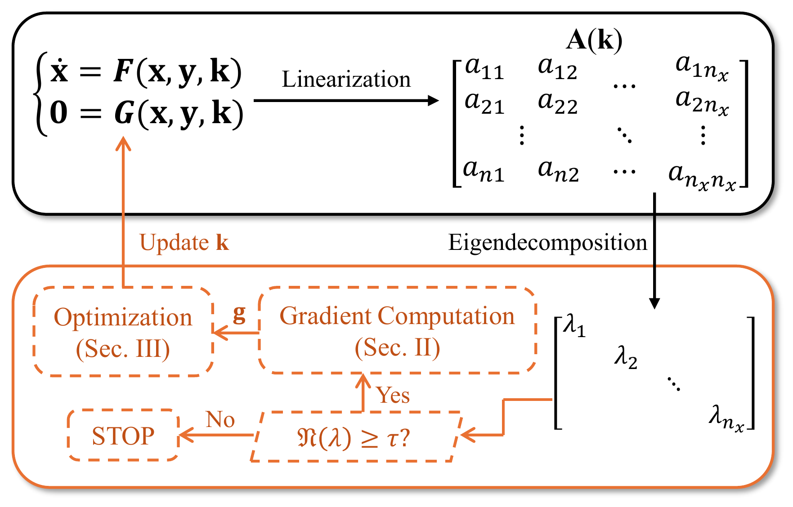
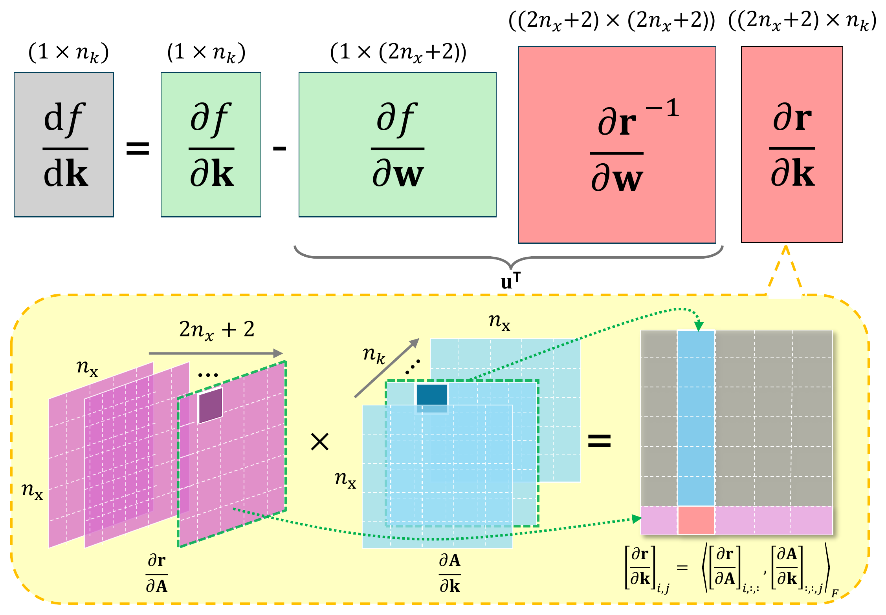
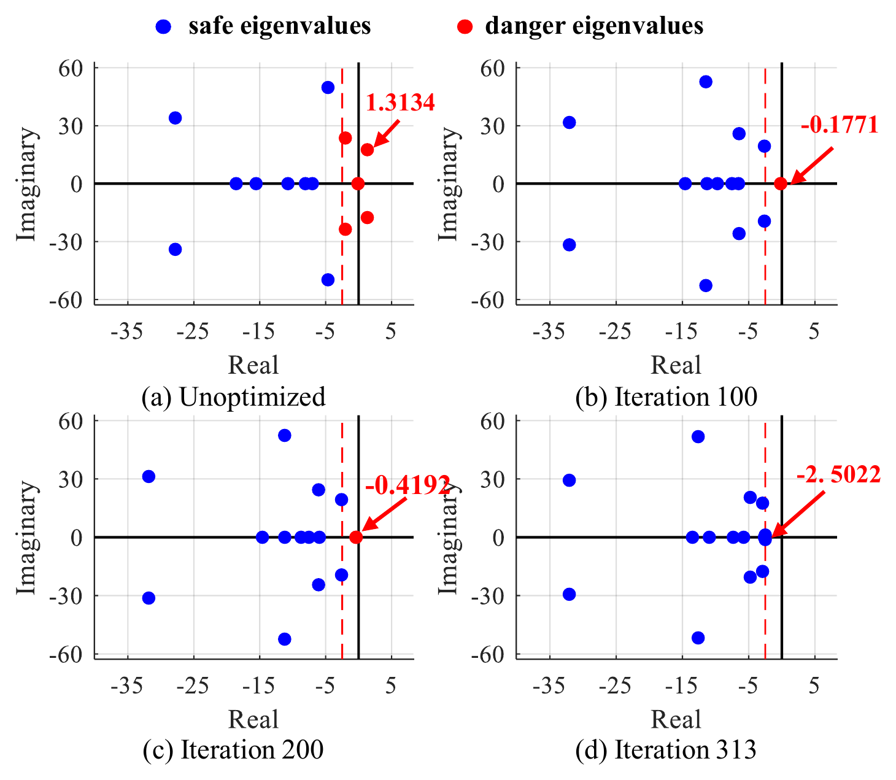
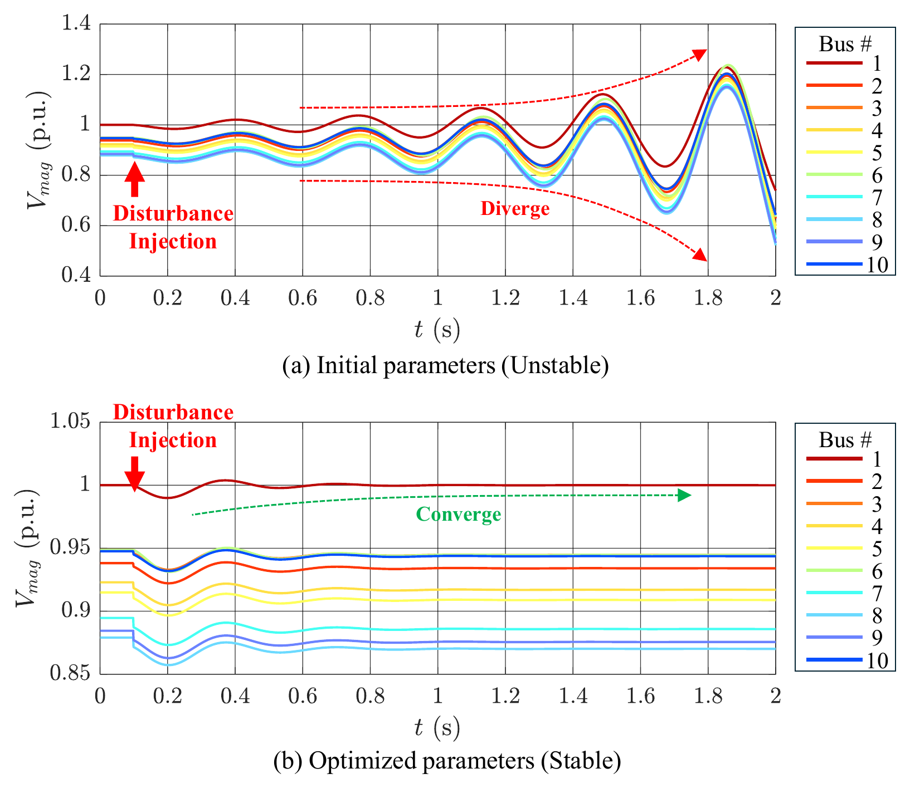
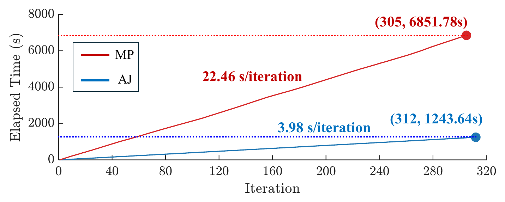
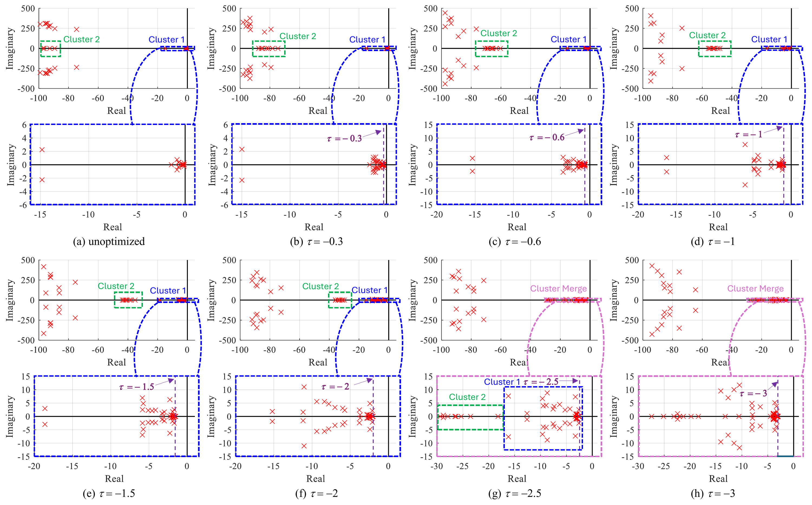
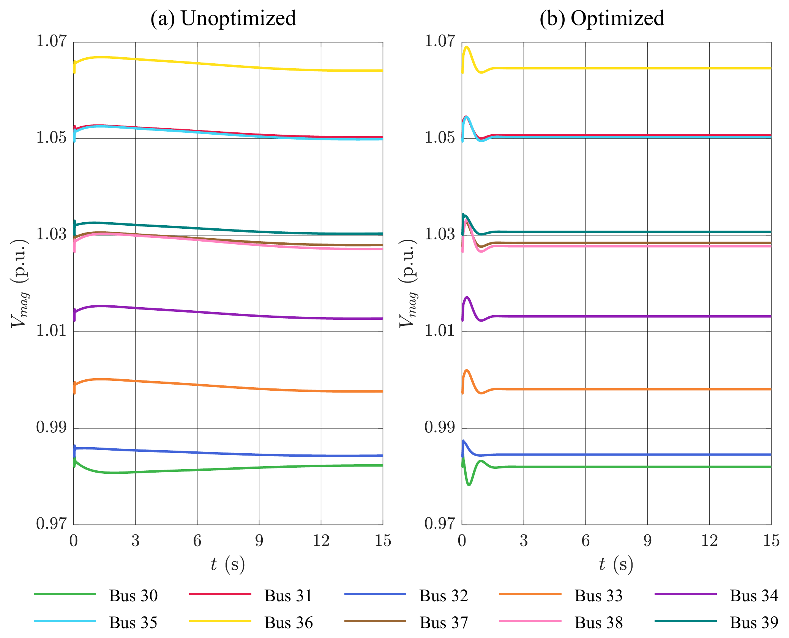

## Overview

::: {.hero}
This project develops a Multi-objective Eigenvalue- and Gradient-Aware Optimization (MEGAO) framework for improving power-system small-signal stability through controller-parameter tuning.

An adjoint-based analytical method is introduced to efficiently compute the sensitivities of critical eigenvalues with respect to controller parameters. The framework combines eigenvalue distributions and gradient information to coordinate multiple stability objectives and progressively focus the optimization on the most critical modes.

Numerical studies show that critical eigenvalues can be shifted further into the stable region while system damping is substantially improved. In the larger test system, low-frequency oscillations are eliminated and voltage returns to a stable state within approximately one second.

The gradient-aware parameter-selection strategy further improves computational efficiency. Selecting the most influential **5–10%** of controller parameters reduces convergence from approximately **97 iterations to 49–50 iterations**, while parallel computation reduces the gradient-calculation time for 29 eigenvalues from **816.59 seconds to 204.57 seconds per iteration**.
:::

---

## Motivation

Power systems with high penetration of inverter-based resources can exhibit reduced inertia and poorly damped oscillatory modes. Their small-signal stability depends strongly on controller parameters such as PLL gains and inner/outer control-loop gains.

A nonlinear IBR-based power-system model can be represented by differential-algebraic equations,

$$
\dot{\mathbf{x}}
=
\mathbf{F}(\mathbf{x},\mathbf{y},\mathbf{k}),
\qquad
\mathbf{0}
=
\mathbf{G}(\mathbf{x},\mathbf{y},\mathbf{k}),
$$

where

- $\mathbf{x}$ contains dynamic states,
- $\mathbf{y}$ contains algebraic variables,
- $\mathbf{k}$ contains tunable controller parameters.

Linearization around an equilibrium point gives

$$
\Delta\dot{\mathbf{x}}
=
\mathbf{A}(\mathbf{k})\Delta\mathbf{x},
$$

with

$$
\mathbf{A}
=
\mathbf{F}_{\mathbf{x}}
-
\mathbf{F}_{\mathbf{y}}
\mathbf{G}_{\mathbf{y}}^{-1}
\mathbf{G}_{\mathbf{x}}.
$$

The eigenvalue problem is

$$
\mathbf{A}\mathbf{v}
=
\lambda\mathbf{v}.
$$

Small-signal stability requires all eigenvalues to satisfy

$$
\Re(\lambda_i)<0.
$$

The optimization problem is therefore to determine how controller parameters should be changed so that critical eigenvalues move toward more negative real parts.

---

## Framework

{fig-align="center" width="95%"}


---

## Core Idea

Instead of repeatedly perturbing every controller parameter and recomputing the full system eigenvalues, the proposed method analytically evaluates the sensitivity of each eigenvalue to the controller parameters.

Let $\mathbf{v}$ and $\widetilde{\mathbf{v}}$ denote the right and left eigenvectors associated with an eigenvalue $\lambda$. The sensitivity of its real part to the state matrix can be written as

$$
\frac{\mathrm{d}\Re(\lambda)}
{\mathrm{d}\mathbf{A}}
=
\Re\left(
\frac{
\widetilde{\mathbf{v}}\mathbf{v}^{*}
}{
\mathbf{v}^{*}\widetilde{\mathbf{v}}
}
\right).
$$

Using the chain rule, the eigenvalue gradient with respect to the controller parameters is

$$
\mathbf{g}_r
=
\frac{\mathrm{d}\Re(\lambda)}
{\mathrm{d}\mathbf{k}}
=
\Re\left(
\frac{
\widetilde{\mathbf{v}}\mathbf{v}^{*}
}{
\mathbf{v}^{*}\widetilde{\mathbf{v}}
}
\right)
\frac{\partial\mathbf{A}}{\partial\mathbf{k}}.
$$

The matrix derivative and the parameter derivative are therefore **decoupled**:

$$
\frac{\mathrm{d}\lambda}{\mathrm{d}\mathbf{k}}
=
\frac{\mathrm{d}\lambda}{\mathrm{d}\mathbf{A}}
\frac{\partial\mathbf{A}}{\partial\mathbf{k}}.
$$

This structure is particularly useful when the number of tunable parameters is large because the operator associated with the eigenvalue derivative can be reused across all parameters.

---

## Adjoint Eigenvalue-Gradient Computation

The adjoint formulation avoids evaluating each parameter sensitivity through repeated model perturbations.

{fig-align="center" width="95%"}

For a selected eigenvalue, the derivative can be implemented as a tensor contraction between

$$
\frac{\mathrm{d}\Re(\lambda)}{\mathrm{d}\mathbf{A}}
$$

and

$$
\frac{\partial\mathbf{A}}{\partial\mathbf{k}}.
$$

Because $\partial\mathbf{A}/\partial\mathbf{k}$ is typically sparse and its sparsity pattern remains fixed for a fixed system structure, it can be precomputed and efficiently reused during optimization.

---

## Progressive MEGAO Framework

Optimizing every system eigenvalue at every iteration is unnecessary. The framework first defines a set of critical or **danger eigenvalues**,

$$
\mathcal{E}(\tau)
=
\left\{
\lambda_i
\mid
\Re(\lambda_i)\geq\tau
\right\},
$$

where $\tau$ is a stability threshold.

Eigenvalues with larger real parts receive larger weights,

$$
w_i
=
\frac{
\exp(\Re(\lambda_i))
}{
\sum_{j=1}^{s}\exp(\Re(\lambda_j))
}.
$$

To reduce conflicting parameter-update directions, the importance of controller parameter $j$ is evaluated as

$$
\mathcal{G}(j)
=
\left|
\sum_{i=1}^{s}
g_j^{(i)}
\right|.
$$

Only the top-$h$ entries are retained in each eigenvalue gradient. The final parameter update is

$$
\mathbf{k}_{N+1}
=
\mathbf{k}_N
-
\eta
\sum_{i=1}^{s}
w_i
\,
\widehat{\mathbf{k}}_N
\odot
\widetilde{\mathbf{g}}_N^{(i)}.
$$

The threshold $\tau$ is progressively decreased so that optimization first focuses on the most critical modes before gradually including additional eigenvalues.

---

## Method

The overall workflow consists of:

1. **Build the nonlinear IBR power-system model**  
   Represent system dynamics using differential-algebraic equations.

2. **Linearize around an operating point**  
   Construct the small-signal state matrix $\mathbf{A}(\mathbf{k})$.

3. **Identify critical eigenvalues**  
   Select eigenvalues satisfying $\Re(\lambda_i)\geq\tau$.

4. **Compute analytical eigenvalue gradients**  
   Use left and right eigenvectors together with $\partial\mathbf{A}/\partial\mathbf{k}$.

5. **Rank influential controller parameters**  
   Retain the top-$h$ gradient components based on aggregated gradient importance.

6. **Perform eigenvalue-aware parameter updates**  
   Apply softmax weighting and feature-wise parameter scaling.

7. **Progressively tighten the stability threshold**  
   Reduce $\tau$ as the most critical eigenvalues become sufficiently damped.

8. **Validate in the time domain**  
   Compare system trajectories before and after optimization.

---

## Representative Python Implementation

The following snippets illustrate the main numerical modules of the MEGAO framework.  
The implementation is organized into four steps: **critical-mode identification, adjoint gradient computation, gradient-aware parameter selection, and progressive optimization**.

### 1. Critical Eigenvalue Identification

At each optimization stage, only eigenvalues inside the current danger region,

$$
\Re(\lambda_i)\geq\tau,
$$

are retained.

The corresponding left and right eigenvectors are also extracted because they are required by the adjoint sensitivity calculation.

```python
import numpy as np
from scipy.linalg import eig

def critical_modes(A, tau):
    lam, vl, vr = eig(A, left=True, right=True)
    idx = np.flatnonzero(lam.real >= tau)

    return lam[idx], vl[:, idx], vr[:, idx]
```

This module reduces the multi-objective problem to the modes that currently require stability improvement.

---

### 2. Adjoint Eigenvalue Gradients

For each active eigenvalue, the controller-parameter sensitivity is

$$
\frac{\mathrm{d}\lambda_i}{\mathrm{d}k_j}
=
\frac{
\mathbf{w}_i^H
\frac{\partial A}{\partial k_j}
\mathbf{v}_i
}{
\mathbf{w}_i^H\mathbf{v}_i
}.
$$

All parameter gradients are evaluated simultaneously using one tensor contraction.

```python
def adjoint_gradients(vl, vr, dA_dk):
    den = np.einsum(
        "im,im->m",
        vl.conj(),
        vr
    )

    num = np.einsum(
        "im,pij,jm->mp",
        vl.conj(),
        dA_dk,
        vr
    )

    return (num / den[:, None]).real
```

The output has shape

$$
N_{\mathrm{modes}}
\times
N_{\mathrm{parameters}},
$$

so each row contains the controller sensitivities of one critical eigenvalue.

---

### 3. Eigenvalue- and Gradient-Aware Direction

MEGAO gives larger weights to eigenvalues closer to instability and retains only the $h$ most influential controller parameters.

```python
def megao_direction(lam, G, h, scale):
    w = np.exp(lam.real - lam.real.max())
    w /= w.sum()

    score = np.abs(G.sum(axis=0))
    keep = np.argsort(score)[-h:]

    mask = np.zeros(G.shape[1])
    mask[keep] = 1.0

    return scale * np.sum(
        w[:, None] * G * mask,
        axis=0
    )
```

Here,

- `w` implements the eigenvalue-aware weighting,
- `score` measures aggregated gradient importance,
- `keep` selects the top-$h$ controller parameters.

The returned vector is the joint update direction for the current set of critical modes.

---

### 4. Progressive Optimization Loop

The complete optimization repeatedly builds the state matrix, identifies critical modes, evaluates their gradients, and updates the controller parameters.

As the system becomes more stable, the threshold $\tau$ is progressively tightened.

```python
def optimize_megao(k, build_A, build_dA, thresholds, h, lr, steps, scale):
    history = []

    for tau in thresholds:
        for _ in range(steps):
            A = build_A(k)
            lam, vl, vr = critical_modes(A, tau)

            if len(lam) == 0:
                break

            G = adjoint_gradients(vl, vr, build_dA(k))
            direction = megao_direction(lam, G, h, scale(k))

            k -= lr * direction
            history.append([tau, lam.real.max()])

    return k, np.asarray(history)
```


This operator-level formulation eliminates the Python loop over controller parameters and maps naturally to optimized tensor kernels.

---

## 10-Bus Test System

The first benchmark contains **2 IBRs and 5 constant-power loads**. The IBR at Bus 1 uses voltage-frequency control, while the IBR at Bus 6 uses active-reactive power control.

A total of **14 controller parameters** are optimized.

{fig-align="center" width="70%"}

For this system, the stability threshold is fixed at

$$
\tau=-2.5,
$$

and five critical eigenvalues are selected for optimization.

Two eigenvalues initially have positive real parts. The proposed optimization rapidly shifts them into the left-half complex plane, after which the remaining danger eigenvalues progressively move toward the safe region.

{fig-align="center" width="82%"}

A disturbance is applied at Load 7 at $t=0.1\,\mathrm{s}$. Before tuning, the voltage trajectories exhibit unstable behavior; after optimization, the trajectories converge to stable operating values.

{fig-align="center" width="82%"}

---

## Computational Efficiency

The adjoint formulation is benchmarked against a conventional matrix-perturbation approach.

| Gradient Method | Total Optimization Time |
|---|---:|
| Matrix Perturbation | 6851.78 s |
| **Adjoint Method** | **1243.64 s** |
| **Speedup** | **≈ 5.5×** |

{fig-align="center" width="90%"}

The formulation was also benchmarked using NumPy and PyTorch implementations. On GPU, the proposed tensor formulation substantially reduced the per-iteration eigenvalue-gradient evaluation time.

| State / Parameter Dimensions | Magnus-Based GPU | Proposed GPU |
|---|---:|---:|
| $80 / 70$ | 8.0365 ms | **0.0292 ms** |
| $400 / 100$ | 11.6844 ms | **0.4435 ms** |
| $800 / 200$ | 17.5915 ms | **3.0129 ms** |
| $1200 / 400$ | 124.5014 ms | **12.8081 ms** |

The largest speedup in these GPU benchmarks occurs for the $80\times80$ state matrix with 70 tunable parameters, where the proposed implementation is approximately **275× faster** for the gradient-evaluation kernel.

---

## IEEE 39-Bus Case Study

The second benchmark extends the framework to the **New England IEEE 39-bus system** with

- **10 IBRs**,
- **70 tunable controller parameters**,
- one voltage-frequency controlled IBR at Bus 31,
- nine active-reactive power controlled IBRs.

Initially, **29 eigenvalues** have real parts greater than $-0.3$, creating a much larger multi-objective optimization problem.

The progressive threshold schedule is

$$
\tau:
-0.3
\rightarrow
-0.6
\rightarrow
-1
\rightarrow
-1.5
\rightarrow
-2
\rightarrow
-2.5
\rightarrow
-3.
$$

This progressive strategy avoids activating too many competing eigenvalue objectives at once.

{fig-align="center" width="98%"}

The optimization improves system damping and enables bus-voltage trajectories to return to stable values within approximately **1 s**.

{fig-align="center" width="88%"}

---

## Effect of Active Parameter Selection

The gradient-aware parameter ranking allows only a fraction of the 70 controller parameters to be updated at each iteration.

| Active Parameter Ratio | Iterations to Convergence |
|---|---:|
| 100% | 97 |
| 50% | 97 |
| 30% | 97 |
| 20% | 98 |
| **10%** | **50** |
| **5%** | **49** |
| 3% | 98 |
| 1% | 98 |

In this experiment, retaining approximately **5–10% of the controller parameters** provides the fastest convergence. Using too few parameters limits available search directions, while using too many increases coupling and gradient conflicts.

---

## Parallel Gradient Computation

The gradients of different critical eigenvalues can be computed independently.

For the IEEE 39-bus case, computing gradients for 29 critical eigenvalues gives:

| Computing Mode | Per-Iteration Gradient Time |
|---|---:|
| Sequential | 816.59 s |
| **Parallel** | **204.57 s** |

This provides an additional approximately **4× reduction** in gradient-evaluation time and makes the framework suitable for multi-core and accelerator-based implementations.

---

## Main Contributions

- Developed a **Multi-objective Eigenvalue- and Gradient-Aware Optimization (MEGAO)** framework for small-signal stability enhancement in IBR-dominated power systems.

- Derived an **adjoint-based analytical eigenvalue-gradient formulation** that decouples eigenvalue sensitivity from the controller-parameter Jacobian.

- Introduced **eigenvalue-aware softmax weighting** to prioritize the modes closest to instability.

- Developed a **gradient-aware parameter-selection strategy** that retains only the most influential controller parameters and mitigates conflicting update directions.

- Introduced a **progressive eigenvalue-threshold strategy** that improves scalability by optimizing only a subset of critical modes at each stage.

- Demonstrated the method on both a **10-bus IBR system** and an **IEEE 39-bus system with 70 tunable parameters**.

- Demonstrated substantial computational acceleration using **vectorized tensor operations, GPU execution, and parallel eigenvalue-gradient evaluation**.

---

## Related Publication

**J. Chen, Y. Li, S. He, and D. Huang**,  
*"Eigenvalue- and Gradient-Aware Optimization for Small-Signal Stability via the Adjoint Method."*

This work develops the adjoint eigenvalue-sensitivity formulation and the progressive MEGAO framework presented on this page.
