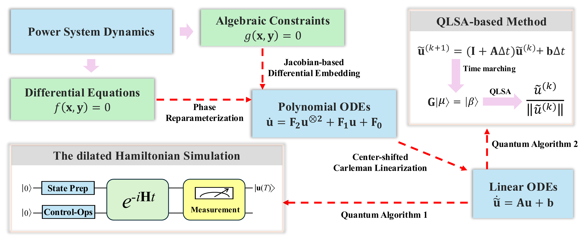
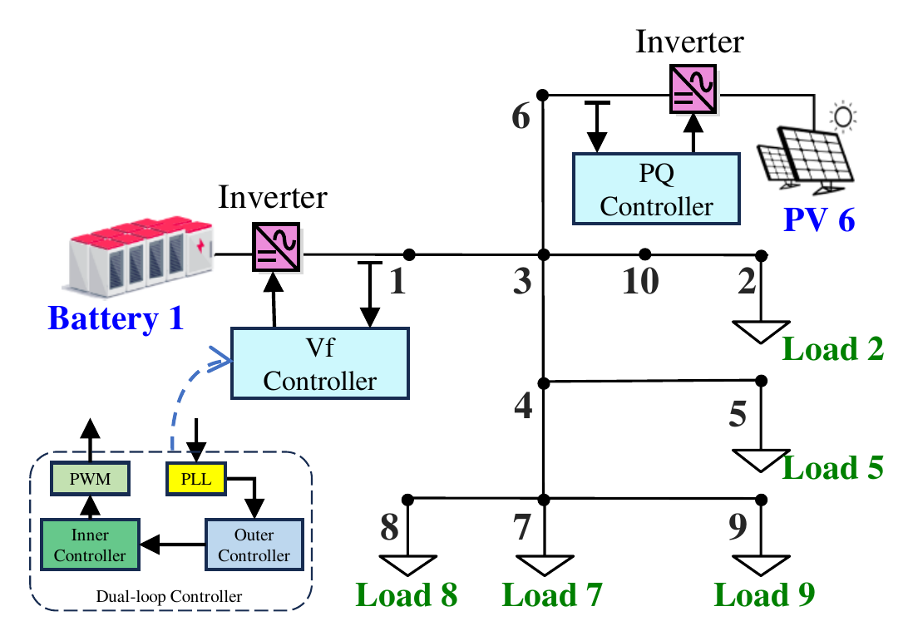
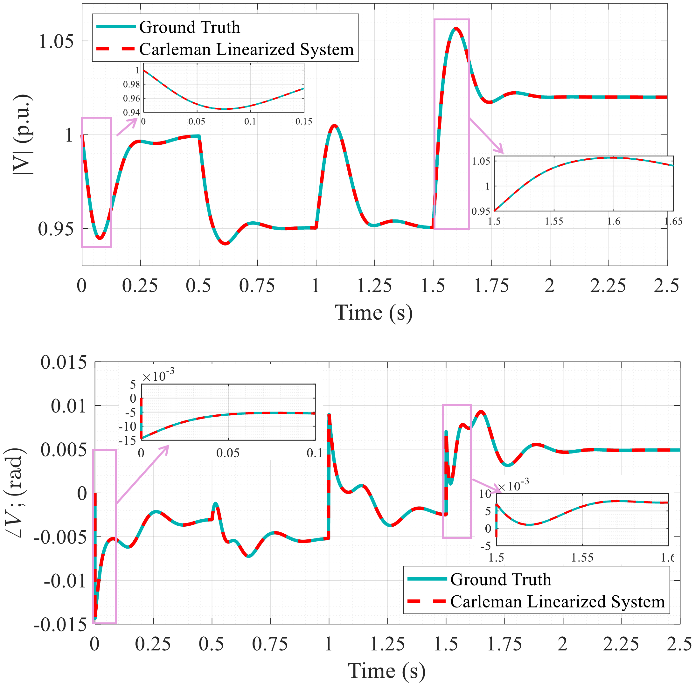
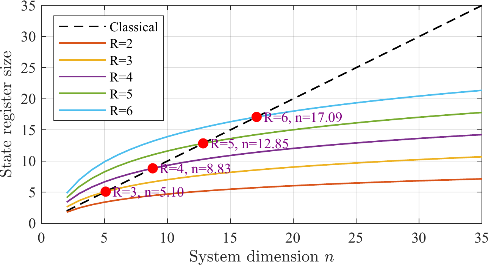
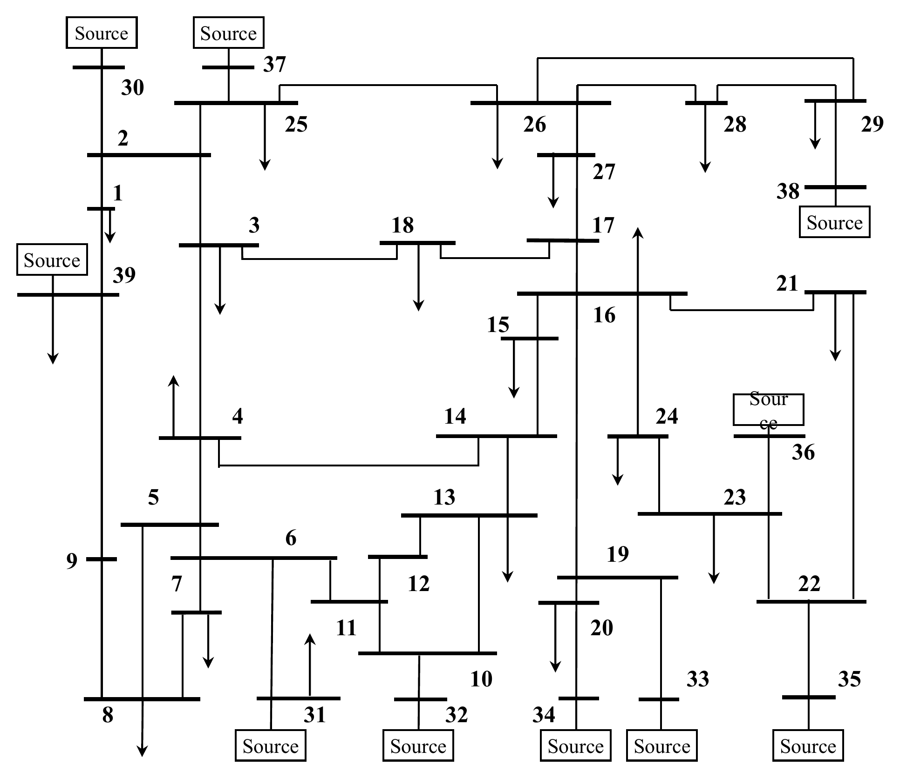
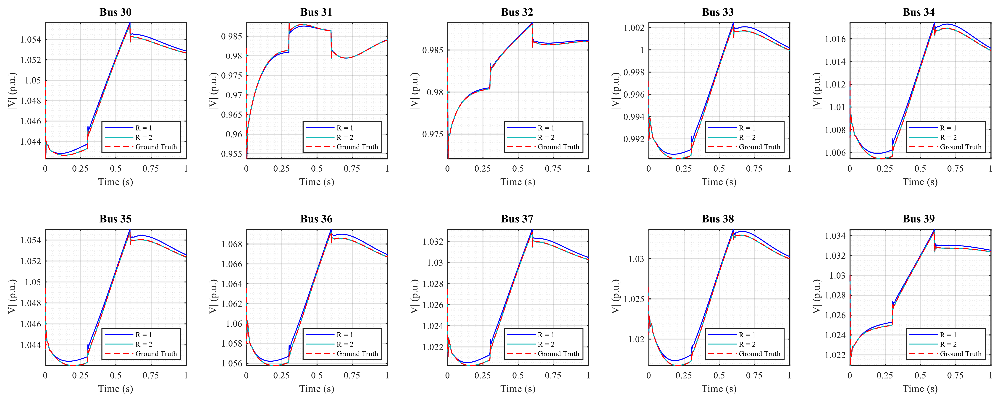
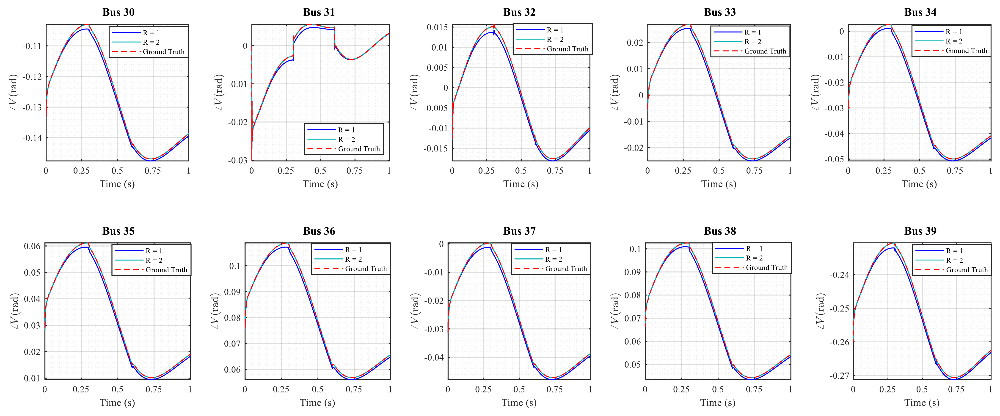
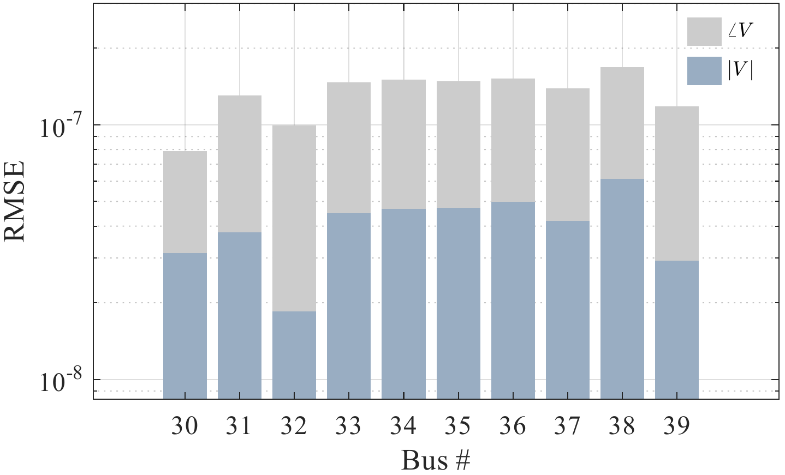
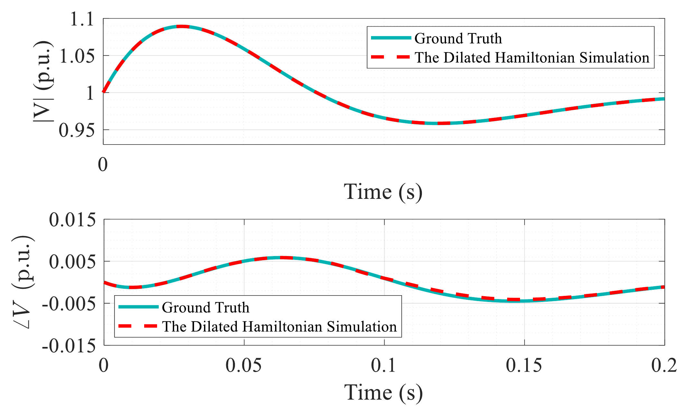

## Overview

::: {.hero}
This project develops a systematic computational framework for transforming nonlinear power-system dynamic models into forms compatible with quantum algorithms.

The framework begins with nonlinear differential-algebraic equations (DAEs). Jacobian-based differential embedding is used to transform algebraic constraints into differential form, while phase reparameterization removes trigonometric nonlinearities from the dynamic equations.

Center-shifted Carleman linearization is then applied to construct a lifted linear dynamic system that approximates the original nonlinear model. This representation provides a pathway for applying quantum linear-system algorithms and quantum dynamic-simulation methods to nonlinear power-system dynamics.

The resulting framework establishes a structured connection between conventional power-system DAEs, polynomial state representations, Carleman lifting, and quantum-compatible linear dynamics.
:::

---

## Motivation

Modern power systems contain increasingly large numbers of converter-interfaced resources, high-order controllers, and nonlinear network interactions. Their dynamics are commonly represented as DAEs,

$$
\dot{\mathbf{x}}
=
f(\mathbf{x},\mathbf{y}),
\qquad
\mathbf{0}
=
g(\mathbf{x},\mathbf{y}),
$$

where

- $\mathbf{x}$ contains differential states,
- $\mathbf{y}$ contains algebraic network variables.

Conventional time-domain simulation advances these states sequentially using numerical integration while repeatedly enforcing the algebraic constraints.

Quantum algorithms, in contrast, are particularly well developed for **linear systems and linear evolution operators**. This creates a representation gap:

$$
\text{nonlinear power-system DAEs}
\quad\not\rightarrow\quad
\text{quantum linear-algebra primitives directly}.
$$

This project addresses that gap by transforming the nonlinear DAE model into a structured lifted linear system while retaining high trajectory accuracy.

---

## Framework

{fig-align="center" width="98%"}

---

## Core Idea

The complete transformation can be summarized as

$$
\boxed{
\text{DAEs}
\rightarrow
\text{ODEs}
\rightarrow
\text{Polynomial ODEs}
\rightarrow
\text{Carleman Linear System}
\rightarrow
\text{Quantum Solver}
}
$$

After the DAE elimination and polynomial reformulation, the system can be represented as

$$
\dot{\mathbf{u}}
=
\mathbf{F}_0
+
\mathbf{F}_1\mathbf{u}
+
\mathbf{F}_2\mathbf{u}^{\otimes 2}
+\cdots+
\mathbf{F}_R\mathbf{u}^{\otimes R}.
$$

Carleman lifting augments the state using higher-order tensor powers,

$$
\widetilde{\mathbf{u}}
=
\left[
\mathbf{u},
\mathbf{u}^{\otimes 2},
\ldots,
\mathbf{u}^{\otimes R}
\right]^{\mathsf T},
$$

which produces the finite-dimensional linear approximation

$$
\dot{\widetilde{\mathbf{u}}}
=
\mathbf{A}\widetilde{\mathbf{u}}
+
\mathbf{b}.
$$

This lifted linear representation is the interface between the original nonlinear power-system model and the quantum simulation algorithms.

---


## DAE-to-ODE Reformulation

Carleman linearization requires a unified ODE representation, so the algebraic constraints must first be converted into differential form.

For

$$
g(\mathbf{x},\mathbf{y})=0,
$$

implicit differentiation gives

$$
\frac{\mathrm{d}\mathbf{y}}{\mathrm{d}t}
\approx
-
\left(
\frac{\partial g}{\partial\mathbf{y}}
\right)^{-1}
\frac{g(\mathbf{x},\mathbf{y})}{\Delta t}
-
\left(
\frac{\partial g}{\partial\mathbf{y}}
\right)^{-1}
\frac{\partial g}{\partial\mathbf{x}}
\frac{\mathrm{d}\mathbf{x}}{\mathrm{d}t}.
$$

For the power-system network equation, this produces an explicit evolution equation for the algebraic variables,

$$
\frac{\mathrm{d}\mathbf{y}}{\mathrm{d}t}
=
\frac{
\mathbf{Y}^{-1}\mathbf{I}(\mathbf{x})
-
\mathbf{y}
}{\Delta t}
+
\mathbf{Y}^{-1}
\frac{\mathrm{d}\mathbf{I}(\mathbf{x})}{\mathrm{d}\mathbf{x}}
\frac{\mathrm{d}\mathbf{x}}{\mathrm{d}t}.
$$

The first term drives the variables toward the original algebraic manifold, while the second term propagates the instantaneous sensitivity generated by the differential states.

---

## Polynomial Reformulation

A major source of nonpolynomial dynamics in inverter controllers is the trigonometric dependence introduced by phase-locked loops.

Instead of directly approximating $\sin x_2$ and $\cos x_2$ around a local operating point, the phase state is reparameterized as

$$
x_c=\cos x_2,
\qquad
x_s=\sin x_2.
$$

Their dynamics satisfy

$$
\dot{x}_c=-x_s\dot{x}_2,
\qquad
\dot{x}_s=x_c\dot{x}_2.
$$

Because sine and cosine are closed under differentiation in this representation, the explicit trigonometric functions can be removed from the state equations.

After this transformation, only a small number of remaining nonpolynomial terms, such as voltage magnitude, require local polynomial approximation.

---

## Center-Shifted Carleman Linearization

For a quadratic polynomial system,

$$
\dot{\mathbf{u}}
=
\mathbf{F}_2\mathbf{u}^{\otimes 2}
+
\mathbf{F}_1\mathbf{u}
+
\mathbf{F}_0,
$$

the Carleman construction treats higher-order monomials as additional states.

To improve numerical behavior, the dynamics are shifted around a reference point $\mathbf{u}^{*}$,

$$
\mathbf{v}
=
\mathbf{u}
-
\mathbf{u}^{*}.
$$

Near the shift center, the state deviations remain smaller, reducing the magnitude of higher-order lifted terms and improving the practical accuracy of a truncated Carleman representation.

For truncation order $R$, the lifted dimension is

$$
N
=
\sum_{i=1}^{R}n^i
=
\frac{n^{R+1}-n}{n-1}
=
\mathcal{O}(n^R).
$$

The resulting matrix has a sparse block-banded structure because each monomial degree interacts only with nearby degrees.

---

## Quantum Solver 1 — Dilated Hamiltonian Simulation

The lifted system is generally nonunitary,

$$
\dot{\widetilde{\mathbf{v}}}
=
\mathbf{A}\widetilde{\mathbf{v}}
+
\mathbf{b},
$$

so standard Hamiltonian simulation cannot be applied directly.

After converting the system to homogeneous form, the linear operator can be decomposed as

$$
\mathbf{A}
=
-i\mathbf{L}
+
\mathbf{K},
$$

where $\mathbf{L}$ and $\mathbf{K}$ are Hermitian.

A larger Hermitian operator is then constructed,

$$
\widetilde{\mathbf{H}}
=
\mathbf{I}_C\otimes\mathbf{L}
+
i\mathbf{M}\otimes\mathbf{K},
$$

where $\mathbf{M}$ is an anti-Hermitian auxiliary operator.

The enlarged quantum state evolves unitarily,

$$
|\Psi(t)\rangle
=
e^{-i\widetilde{\mathbf{H}}t}
|\Psi(0)\rangle,
$$

and the original nonunitary linear dynamics can be recovered through an appropriate projection.

This formulation provides a route for connecting the Carleman-linearized power-system model to Hamiltonian-simulation techniques.

---

## Quantum Solver 2 — QLSA-Based Time Marching

A second approach discretizes the lifted ODE in time. Using forward Euler for illustration,

$$
\widetilde{\mathbf{v}}^{(k+1)}
=
\widetilde{\mathbf{v}}^{(k)}
+
\Delta t\,
\mathbf{A}\widetilde{\mathbf{v}}^{(k)}
+
\Delta t\,\mathbf{b}.
$$

All time steps can be stacked into a single linear system,

$$
\mathbf{G}\boldsymbol{\mu}
=
\boldsymbol{\beta},
$$

with the block lower-bidiagonal history matrix

$$
\mathbf{G}
=
\begin{pmatrix}
\mathbf{I} & & & \\
-(\mathbf{I}+\mathbf{A}\Delta t) & \mathbf{I} & & \\
& \ddots & \ddots & \\
& & -(\mathbf{I}+\mathbf{A}\Delta t) & \mathbf{I}
\end{pmatrix}.
$$

A quantum linear-system algorithm can then be used conceptually to prepare a state proportional to

$$
|\boldsymbol{\mu}\rangle
\propto
\mathbf{G}^{-1}
|\boldsymbol{\beta}\rangle.
$$

This formulation converts time-domain simulation into a global linear-algebra problem over the entire time horizon.

---

## Method

The workflow used in this project is:

1. **Construct the nonlinear inverter-based power-system DAEs.**
2. **Differentiate the algebraic constraints** using the algebraic Jacobian.
3. **Separate real and imaginary network variables** to obtain real-valued ODEs.
4. **Reparameterize phase states** using sine/cosine state pairs.
5. **Approximate the remaining nonpolynomial terms** to obtain polynomial ODEs.
6. **Shift the system around a reference point** to improve truncation behavior.
7. **Apply finite-order Carleman lifting** to obtain a structured linear ODE.
8. **Validate the lifted model** against the original nonlinear time-domain simulation.
9. **Map the linear model to quantum solvers**, including dilated Hamiltonian simulation and QLSA-based time marching.
10. **Evaluate state-register scaling and numerical accuracy** on benchmark power systems.

---

## Representative Python Implementation

The following snippets illustrate the main computational modules of the framework.  

### 1. Jacobian-Based DAE Embedding

The algebraic constraint

$$
g(x,y)=0
$$

is converted into an ODE-like evolution using the Jacobians with respect to differential and algebraic variables.

Instead of explicitly computing $J_y^{-1}$, the implementation solves the corresponding linear system directly.

```python
import numpy as np

def algebraic_derivative(x, y, dx, g, Jx, Jy, dt):
    rhs = g(x, y) / dt + Jx(x, y) @ dx
    return -np.linalg.solve(Jy(x, y), rhs)
```

This module provides the derivative of the algebraic variables so that differential and algebraic states can be handled in a unified dynamical model.

---

### 2. Phase Reparameterization

Trigonometric PLL states are replaced by

$$
x_c=\cos\theta,
\qquad
x_s=\sin\theta,
$$

with dynamics

$$
\dot{x}_c=-x_s\dot{\theta},
\qquad
\dot{x}_s=x_c\dot{\theta}.
$$

```python
def phase_states(theta, theta_dot):
    xc, xs = np.cos(theta), np.sin(theta)
    return xc, xs, -xs * theta_dot, xc * theta_dot
```

This removes explicit sine and cosine functions from the state equations and makes the model compatible with polynomial lifting.

---

### 3. Carleman State Lifting

For a polynomial system, Carleman linearization augments the original state with higher-order tensor products,

$$
z=
\left[
u,\,
u^{\otimes2},
\ldots,
u^{\otimes R}
\right].
$$

The lifted state can be generated recursively.

```python
def carleman_state(u, R):
    blocks = [np.asarray(u)]

    for _ in range(2, R + 1):
        blocks.append(
            np.kron(blocks[-1], u)
        )

    return np.concatenate(blocks)
```

For a quadratic model

$$
\dot{u}
=
F_0+F_1u+F_2u^{\otimes2},
$$

each Carleman block is assembled from Kronecker products of the polynomial operators.

```python
def lift_block(F, n, degree):
    block = 0

    for i in range(degree):
        block += np.kron(
            np.kron(np.eye(n**i), F),
            np.eye(n**(degree-i-1))
        )

    return block
```

The complete truncated Carleman matrix is obtained by arranging these blocks according to polynomial degree and discarding terms above order $R$.

This separation keeps the implementation modular: `carleman_state()` constructs the lifted state, while `lift_block()` provides the building block for the lifted dynamics.

---

### 4. Classical Validation

The nonlinear model and the lifted linear system are simulated side by side to evaluate truncation accuracy.

A compact RK4 integrator is used for both models.

```python
def rk4(f, x, dt):
    k1 = f(x)
    k2 = f(x + dt*k1/2)
    k3 = f(x + dt*k2/2)
    k4 = f(x + dt*k3)

    return x + dt*(k1 + 2*k2 + 2*k3 + k4)/6
```

The validation loop then becomes

```python
def simulate(f, A, b, u0, R, dt, steps):
    u = u0.copy()
    z = carleman_state(u0, R)

    original, lifted = [], []

    for _ in range(steps):
        u = rk4(f, u, dt)
        z = rk4(lambda z: A @ z + b, z, dt)

        original.append(u.copy())
        lifted.append(z[:len(u0)].copy())

    return np.array(original), np.array(lifted)
```

The first-order components of the lifted state are directly compared with the original nonlinear trajectories.

---

### 5. QLSA History System

After time discretization,

$$
v^{(k+1)}
=
(I+A\Delta t)v^{(k)}
+
b\Delta t,
$$

all time steps can be combined into a sparse block lower-bidiagonal linear system,

$$
G\mu=\beta.
$$

```python
from scipy.sparse import eye, bmat

def history_matrix(A, dt, T):
    I = eye(A.shape[0], format="csr")
    step = I + dt * A

    blocks = [
        [
            I if i == j
            else -step if i == j + 1
            else None
            for j in range(T)
        ]
        for i in range(T)
    ]

    return bmat(blocks, format="csr")
```

The right-hand side contains the initial state followed by the forcing terms.

```python
def history_rhs(v0, b, dt, T):
    return np.concatenate(
        [v0] + [dt * b] * (T - 1)
    )
```

This module converts sequential time marching into a single structured linear-algebra problem suitable for a QLSA formulation.

---

### 6. Hermitian Dilation

The Carleman matrix is generally non-Hermitian. It is first decomposed as

$$
A=-iL+K,
$$

where $L$ and $K$ are Hermitian.

```python
def hermitian_parts(A):
    K = (A + A.conj().T) / 2
    L = 0.5j * (A - A.conj().T)
    return L, K
```

A larger Hermitian operator can then embed the original nonunitary dynamics.

```python
def dilated_hamiltonian(A):
    L, K = hermitian_parts(A)

    M = np.array([
        [0, 1],
        [-1, 0]
    ], dtype=complex)

    return (
        np.kron(np.eye(2), L)
        + 1j * np.kron(M, K)
    )
```

This produces the Hermitian operator used by the dilation-based quantum simulation.

---

### 7. Representative Qiskit Evolution

For a small proof-of-concept system, one evolution step can be emulated with a unitary generated from the dilated Hamiltonian.

```python
from scipy.linalg import expm
from qiskit import QuantumCircuit
from qiskit.circuit.library import UnitaryGate

def dilation_circuit(H, dt):
    U = expm(-1j * H * dt)
    n = int(np.log2(H.shape[0]))

    qc = QuantumCircuit(n)
    qc.append(UnitaryGate(U), range(n))

    return qc
```

The dense matrix exponential is used here only for numerical demonstration. A scalable quantum implementation would instead require an efficient Hamiltonian representation and corresponding Hamiltonian-simulation primitives.

---

## 10-Bus Case Study

The first benchmark uses a **10-bus inverter-based power system** with

- a voltage-frequency controlled generation unit at Bus 1,
- a PQ-controlled generation unit at Bus 6,
- five constant-power loads.

{fig-align="center" width="68%"}

The model is tested under multiple disturbances:

- at $t=0$, the load at Bus 7 is increased by **300%**;
- at $t=0.5\,\mathrm{s}$, the voltage reference changes from $1.0$ to $0.95$ p.u.;
- at $t=1.0\,\mathrm{s}$, the Bus 7 load is restored;
- at $t=1.5\,\mathrm{s}$, a current injection of $0.05+j0.01$ p.u. is applied at Bus 1 while the voltage reference changes to $1.02$ p.u.

The Carleman-linearized system closely follows the original nonlinear dynamics through all of these events.

{fig-align="center" width="80%"}

### Truncation Accuracy

The RMSE at Bus 1 remains extremely small even for a low Carleman truncation order.

| Variable | $R=2$ | $R=3$ | $R=4$ |
|---|---:|---:|---:|
| $x_1$ | $9.009\times10^{-10}$ | $7.943\times10^{-11}$ | $7.731\times10^{-11}$ |
| $\cos x_2$ | $3.654\times10^{-10}$ | $5.547\times10^{-12}$ | $2.586\times10^{-12}$ |
| $\sin x_2$ | $7.612\times10^{-9}$ | $6.169\times10^{-10}$ | $5.987\times10^{-10}$ |
| $V$ | $1.629\times10^{-8}$ | $1.195\times10^{-8}$ | $1.195\times10^{-8}$ |
| $\angle V$ | $5.218\times10^{-9}$ | $8.420\times10^{-8}$ | $8.420\times10^{-8}$ |

The results show that $R=2$ already provides a favorable accuracy-efficiency trade-off for this study.

---

## State-Register Scaling

The lifted dimension grows polynomially with the original system dimension, but an amplitude-encoded quantum state requires only logarithmically many state-register qubits.

{fig-align="center" width="82%"}

For a lifted dimension $N$, the state register requires approximately

$$
n_q
=
\left\lceil
\log_2 N
\right\rceil
$$

qubits, excluding ancillary resources required by the complete quantum algorithm.

---

## IEEE 39-Bus Case Study

The second benchmark uses the **IEEE 39-bus New England system** with 10 generation units. Bus 31 uses voltage-frequency control and the remaining generation units use PQ control.

{fig-align="center" width="72%"}

The test applies multiple disturbances:

- at $t=0$, the active-power demand at Bus 31 is increased by **10×**;
- at $t=0.3\,\mathrm{s}$, the Bus 31 voltage reference changes from $0.982$ to $1.02$ p.u.;
- at $t=0.6\,\mathrm{s}$, the reference is restored.

### Voltage Magnitude

{fig-align="center" width="98%"}

### Voltage Angle

{fig-align="center" width="98%"}

For $R\geq2$, the aggregate trajectory error remains around $10^{-7}$.

{fig-align="center" width="78%"}

---

## Dilated Hamiltonian Simulation

The dilated Hamiltonian formulation is numerically emulated on a reduced 10-bus test case to demonstrate that the quantum-compatible linear representation reproduces the physical trajectories.

{fig-align="center" width="90%"}

The resulting trajectories closely match the classical integration baseline over the simulated horizon.

This experiment is intended as a numerical validation of the **dilation-based formulation** rather than an end-to-end fault-tolerant quantum implementation.

---

## Quantum State-Register Estimates

For the $R=2$ lifted systems used in the analysis:

| System | Lifted Dimension $N$ | State-Register Qubits |
|---|---:|---:|
| 10-Bus | 272 | **9** |
| IEEE 39-Bus | 6480 | **13** |

The lifted dimension therefore grows by almost $24\times$ between the two benchmark systems, while the state register increases from only 9 to 13 qubits.

These numbers refer only to storage of the lifted state. Practical implementations additionally require ancilla qubits for Hamiltonian encoding, block encoding, amplitude amplification, or other algorithmic subroutines.

---


## Main Contributions

- Developed a **systematic DAE-to-linear transformation pipeline** that makes nonlinear power-system dynamics compatible with quantum linear-algebraic solvers.

- Introduced a **Jacobian-based differential embedding** that converts algebraic network constraints into explicit ODE-compatible dynamics.

- Applied **phase reparameterization** to remove trigonometric nonlinearities before Carleman lifting.

- Developed a **center-shifted Carleman formulation** that preserves nonlinear polynomial structure while producing a structured finite-dimensional linear system.

- Connected the transformed model to two complementary quantum paradigms: **dilated Hamiltonian simulation** and **QLSA-based global time marching**.

- Demonstrated high trajectory accuracy on both **10-bus** and **IEEE 39-bus** benchmark systems under large disturbances and changing operating points.

- Numerically demonstrated that a **dilated Hamiltonian formulation** can closely reproduce power-system voltage trajectories.

- Quantified the logarithmic scaling of the **quantum state register**, requiring 9 and 13 state-register qubits for the lifted 10-bus and IEEE 39-bus examples, respectively.

---

## Related Publication

**J. Chen, X. Li, Y. Li, H. P. Paudel, Y. Duan, M. Ismail, and W. Saad**,  
*"From Power System DAEs to Quantum Solvers: A Carleman-Based Dynamic Simulation Framework."*

This work develops the DAE reformulation, polynomialization, Carleman lifting, and quantum-solver interfaces presented on this page.
